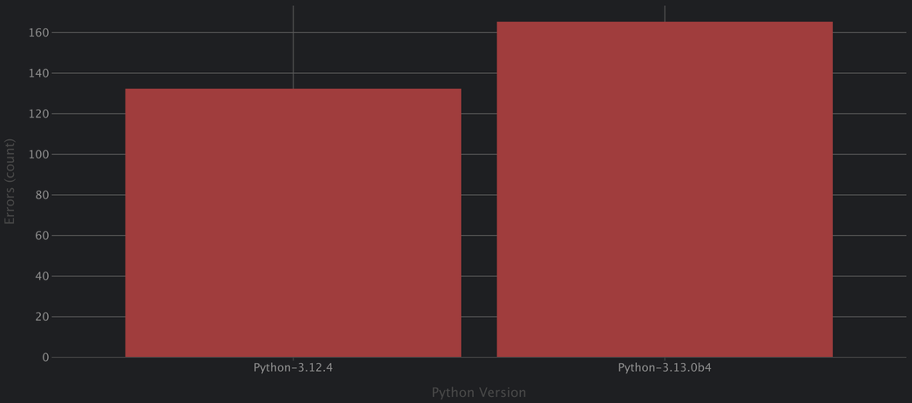

:cpython: https://github.com/python/cpython
:argo-workflow: https://argoproj.github.io/workflows/
:jinja2: https://jinja.palletsprojects.com/en/

= About

This repository contains scripts to mass rebuild {cpython}[CPython].

Target build scripts content generated by combination of target platform, OS, compiler, etc.:

Platforms:

- amd64
- arm64

OS:

- Fedora 40
- Ubuntu 24.04

CPython:

- 3.12.4 (latest stable release)
- 3.13.0.b4 (latest beta release)

Compiler (version depends on OS):

- gcc
- clang

Compiler options:

- none (default options)
- Address Sanitizer
- Hardware Address Sanitizer
- Thread Sanitizer
- Static analyzer (gcc only)

Hardware Address Sanitizer additional options (clang only):

- none (default options)
- without tracking globals variables

Sanitizer link method:

- none (chose by compiler)
- shared
- static

Sanitizer runtime preload (via `LDPRELOAD`):

- enabled
- disabled

CPython configure options:

- debug
- default
- release
- no-gil

== Results
I made few starts:

- With Hardware Address Sanitizer on arm64
- With Static Analyzer on amd64
- Other configurations on amd64 on amd64

=== With Hardware Address Sanitizer on arm64

* No successful builds on GCC and enabled LD_PRELOAD
* No successful builds on clang and -mllvm -hwasan-globals=1
* No stable builds on GCC and static hwasan library (sometime works but failed tests can't be reproduced with clang)
* No successful builds on clang, static hwasan and enabled LD_PRELOAD (looks like preloaded library track the globals)

[%header, format=csv]
|===
Platform,BaseImage,Compiler,CompilerOption,SanLinksMethod,ClangHWasanAdditionalOption,LDPreloadMode,PythonVersion,BuildOption,script_name,Result
arm64,fedora,gcc,hwasan,shared,none,enabled,3.12.4,debug,build_001.sh,Configure. Segmentation fault
arm64,fedora,gcc,hwasan,shared,none,enabled,3.12.4,default,build_002.sh,Configure. Segmentation fault
arm64,fedora,gcc,hwasan,shared,none,enabled,3.12.4,release,build_003.sh,Configure. Segmentation fault
arm64,fedora,gcc,hwasan,shared,none,disabled,3.12.4,debug,build_004.sh,Tests. Failed
arm64,fedora,gcc,hwasan,shared,none,disabled,3.12.4,default,build_005.sh,Tests. Segmentation fault
arm64,fedora,gcc,hwasan,shared,none,disabled,3.12.4,release,build_006.sh,Tests. Segmentation fault
arm64,fedora,gcc,hwasan,static,none,enabled,3.12.4,debug,build_007.sh,Configure. Segmentation fault
arm64,fedora,gcc,hwasan,static,none,enabled,3.12.4,default,build_008.sh,Configure. Segmentation fault
arm64,fedora,gcc,hwasan,static,none,enabled,3.12.4,release,build_009.sh,Configure. Segmentation fault
arm64,fedora,gcc,hwasan,static,none,disabled,3.12.4,debug,build_010.sh,Configure. Failed
arm64,fedora,gcc,hwasan,static,none,disabled,3.12.4,default,build_011.sh,Configure. Failed
arm64,fedora,gcc,hwasan,static,none,disabled,3.12.4,release,build_012.sh,Configure. Failed
arm64,fedora,clang,hwasan,shared,none,enabled,3.12.4,debug,build_013.sh,Compilation. Failed
arm64,fedora,clang,hwasan,shared,-mllvm -hwasan-globals=0,enabled,3.12.4,debug,build_014.sh,Compilation. Failed
arm64,fedora,clang,hwasan,shared,none,enabled,3.12.4,default,build_015.sh,Compilation. Failed
arm64,fedora,clang,hwasan,shared,-mllvm -hwasan-globals=0,enabled,3.12.4,default,build_016.sh,Tests. Failed
arm64,fedora,clang,hwasan,shared,none,enabled,3.12.4,release,build_017.sh,Compilation. Failed
arm64,fedora,clang,hwasan,shared,-mllvm -hwasan-globals=0,enabled,3.12.4,release,build_018.sh,Tests. Segmentation fault
arm64,fedora,clang,hwasan,shared,none,disabled,3.12.4,debug,build_019.sh,Configure. Failed
arm64,fedora,clang,hwasan,shared,-mllvm -hwasan-globals=0,disabled,3.12.4,debug,build_020.sh,Configure. Failed
arm64,fedora,clang,hwasan,shared,none,disabled,3.12.4,default,build_021.sh,Configure. Failed
arm64,fedora,clang,hwasan,shared,-mllvm -hwasan-globals=0,disabled,3.12.4,default,build_022.sh,Configure. Failed
arm64,fedora,clang,hwasan,shared,none,disabled,3.12.4,release,build_023.sh,Configure. Failed
arm64,fedora,clang,hwasan,shared,-mllvm -hwasan-globals=0,disabled,3.12.4,release,build_024.sh,Configure. Failed
arm64,fedora,clang,hwasan,static,none,enabled,3.12.4,debug,build_025.sh,Configure. Timeout
arm64,fedora,clang,hwasan,static,-mllvm -hwasan-globals=0,enabled,3.12.4,debug,build_026.sh,Configure. Timeout
arm64,fedora,clang,hwasan,static,none,enabled,3.12.4,default,build_027.sh,Configure. Timeout
arm64,fedora,clang,hwasan,static,-mllvm -hwasan-globals=0,enabled,3.12.4,default,build_028.sh,Configure. Timeout
arm64,fedora,clang,hwasan,static,none,enabled,3.12.4,release,build_029.sh,Configure. Timeout
arm64,fedora,clang,hwasan,static,-mllvm -hwasan-globals=0,enabled,3.12.4,release,build_030.sh,Configure. Timeout
arm64,fedora,clang,hwasan,static,none,disabled,3.12.4,debug,build_031.sh,Compilation. Failed
arm64,fedora,clang,hwasan,static,-mllvm -hwasan-globals=0,disabled,3.12.4,debug,build_032.sh,Tests. Failed
arm64,fedora,clang,hwasan,static,none,disabled,3.12.4,default,build_033.sh,Compilation. Failed
arm64,fedora,clang,hwasan,static,-mllvm -hwasan-globals=0,disabled,3.12.4,default,build_034.sh,Tests. Failed
arm64,fedora,clang,hwasan,static,none,disabled,3.12.4,release,build_035.sh,Compilation. Failed
arm64,fedora,clang,hwasan,static,-mllvm -hwasan-globals=0,disabled,3.12.4,release,build_036.sh,Tests. Segmentation fault
arm64,fedora,gcc,hwasan,shared,none,enabled,3.13.0b4,debug,build_037.sh,Configure. Segmentation fault
arm64,fedora,gcc,hwasan,shared,none,enabled,3.13.0b4,default,build_038.sh,Configure. Segmentation fault
arm64,fedora,gcc,hwasan,shared,none,enabled,3.13.0b4,release,build_039.sh,Configure. Segmentation fault
arm64,fedora,gcc,hwasan,shared,none,enabled,3.13.0b4,without_git,build_040.sh,Configure. Segmentation fault
arm64,fedora,gcc,hwasan,shared,none,disabled,3.13.0b4,debug,build_041.sh,Tests. Aborted
arm64,fedora,gcc,hwasan,shared,none,disabled,3.13.0b4,default,build_042.sh,Tests. Segmentation fault
arm64,fedora,gcc,hwasan,shared,none,disabled,3.13.0b4,release,build_043.sh,Tests. Segmentation fault
arm64,fedora,gcc,hwasan,shared,none,disabled,3.13.0b4,without_git,build_044.sh,Tests. Segmentation fault
arm64,fedora,gcc,hwasan,static,none,enabled,3.13.0b4,debug,build_045.sh,Configure. Segmentation fault
arm64,fedora,gcc,hwasan,static,none,enabled,3.13.0b4,default,build_046.sh,Configure. Segmentation fault
arm64,fedora,gcc,hwasan,static,none,enabled,3.13.0b4,release,build_047.sh,Configure. Segmentation fault
arm64,fedora,gcc,hwasan,static,none,enabled,3.13.0b4,without_git,build_048.sh,Configure. Segmentation fault
arm64,fedora,gcc,hwasan,static,none,disabled,3.13.0b4,debug,build_049.sh,Configure. Failed
arm64,fedora,gcc,hwasan,static,none,disabled,3.13.0b4,default,build_050.sh,Configure. Failed
arm64,fedora,gcc,hwasan,static,none,disabled,3.13.0b4,release,build_051.sh,Configure. Failed
arm64,fedora,gcc,hwasan,static,none,disabled,3.13.0b4,without_git,build_052.sh,Configure. Failed
arm64,fedora,clang,hwasan,shared,none,enabled,3.13.0b4,debug,build_053.sh,Compilation. Failed
arm64,fedora,clang,hwasan,shared,-mllvm -hwasan-globals=0,enabled,3.13.0b4,debug,build_054.sh,Tests. Aborted
arm64,fedora,clang,hwasan,shared,none,enabled,3.13.0b4,default,build_055.sh,Compilation. Failed
arm64,fedora,clang,hwasan,shared,-mllvm -hwasan-globals=0,enabled,3.13.0b4,default,build_056.sh,Tests. Failed
arm64,fedora,clang,hwasan,shared,none,enabled,3.13.0b4,release,build_057.sh,Compilation. Failed
arm64,fedora,clang,hwasan,shared,-mllvm -hwasan-globals=0,enabled,3.13.0b4,release,build_058.sh,Tests. Segmentation fault
arm64,fedora,clang,hwasan,shared,none,enabled,3.13.0b4,without_git,build_059.sh,Compilation. Failed
arm64,fedora,clang,hwasan,shared,-mllvm -hwasan-globals=0,enabled,3.13.0b4,without_git,build_060.sh,Tests. Failed
arm64,fedora,clang,hwasan,shared,none,disabled,3.13.0b4,debug,build_061.sh,Configure. Failed
arm64,fedora,clang,hwasan,shared,-mllvm -hwasan-globals=0,disabled,3.13.0b4,debug,build_062.sh,Configure. Failed
arm64,fedora,clang,hwasan,shared,none,disabled,3.13.0b4,default,build_063.sh,Configure. Failed
arm64,fedora,clang,hwasan,shared,-mllvm -hwasan-globals=0,disabled,3.13.0b4,default,build_064.sh,Configure. Failed
arm64,fedora,clang,hwasan,shared,none,disabled,3.13.0b4,release,build_065.sh,Configure. Failed
arm64,fedora,clang,hwasan,shared,-mllvm -hwasan-globals=0,disabled,3.13.0b4,release,build_066.sh,Configure. Failed
arm64,fedora,clang,hwasan,shared,none,disabled,3.13.0b4,without_git,build_067.sh,Configure. Failed
arm64,fedora,clang,hwasan,shared,-mllvm -hwasan-globals=0,disabled,3.13.0b4,without_git,build_068.sh,Configure. Failed
arm64,fedora,clang,hwasan,static,none,enabled,3.13.0b4,debug,build_069.sh,Configure. Timeout
arm64,fedora,clang,hwasan,static,-mllvm -hwasan-globals=0,enabled,3.13.0b4,debug,build_070.sh,Configure. Timeout
arm64,fedora,clang,hwasan,static,none,enabled,3.13.0b4,default,build_071.sh,Configure. Timeout
arm64,fedora,clang,hwasan,static,-mllvm -hwasan-globals=0,enabled,3.13.0b4,default,build_072.sh,Configure. Timeout
arm64,fedora,clang,hwasan,static,none,enabled,3.13.0b4,release,build_073.sh,Configure. Timeout
arm64,fedora,clang,hwasan,static,-mllvm -hwasan-globals=0,enabled,3.13.0b4,release,build_074.sh,Configure. Timeout
arm64,fedora,clang,hwasan,static,none,enabled,3.13.0b4,without_git,build_075.sh,Configure. Timeout
arm64,fedora,clang,hwasan,static,-mllvm -hwasan-globals=0,enabled,3.13.0b4,without_git,build_076.sh,Configure. Timeout
arm64,fedora,clang,hwasan,static,none,disabled,3.13.0b4,debug,build_077.sh,Compilation. Failed
arm64,fedora,clang,hwasan,static,-mllvm -hwasan-globals=0,disabled,3.13.0b4,debug,build_078.sh,Tests. Aborted
arm64,fedora,clang,hwasan,static,none,disabled,3.13.0b4,default,build_079.sh,Compilation. Failed
arm64,fedora,clang,hwasan,static,-mllvm -hwasan-globals=0,disabled,3.13.0b4,default,build_080.sh,Tests. Failed
arm64,fedora,clang,hwasan,static,none,disabled,3.13.0b4,release,build_081.sh,Compilation. Failed
arm64,fedora,clang,hwasan,static,-mllvm -hwasan-globals=0,disabled,3.13.0b4,release,build_082.sh,Tests. Segmentation fault
arm64,fedora,clang,hwasan,static,none,disabled,3.13.0b4,without_git,build_083.sh,Compilation. Failed
arm64,fedora,clang,hwasan,static,-mllvm -hwasan-globals=0,disabled,3.13.0b4,without_git,build_084.sh,Tests. Failed
arm64,ubuntu,gcc,hwasan,shared,none,enabled,3.12.4,debug,build_085.sh,Configure. Segmentation fault
arm64,ubuntu,gcc,hwasan,shared,none,enabled,3.12.4,default,build_086.sh,Configure. Segmentation fault
arm64,ubuntu,gcc,hwasan,shared,none,enabled,3.12.4,release,build_087.sh,Configure. Segmentation fault
arm64,ubuntu,gcc,hwasan,shared,none,disabled,3.12.4,debug,build_088.sh,Tests. Failed
arm64,ubuntu,gcc,hwasan,shared,none,disabled,3.12.4,default,build_089.sh,Tests. Segmentation fault
arm64,ubuntu,gcc,hwasan,shared,none,disabled,3.12.4,release,build_090.sh,Tests. Segmentation fault
arm64,ubuntu,gcc,hwasan,static,none,enabled,3.12.4,debug,build_091.sh,Configure. Segmentation fault
arm64,ubuntu,gcc,hwasan,static,none,enabled,3.12.4,default,build_092.sh,Configure. Segmentation fault
arm64,ubuntu,gcc,hwasan,static,none,enabled,3.12.4,release,build_093.sh,Configure. Segmentation fault
arm64,ubuntu,gcc,hwasan,static,none,disabled,3.12.4,debug,build_094.sh,Tests. Timeout
arm64,ubuntu,gcc,hwasan,static,none,disabled,3.12.4,default,build_095.sh,Tests. Timeout
arm64,ubuntu,gcc,hwasan,static,none,disabled,3.12.4,release,build_096.sh,Tests. Timeout
arm64,ubuntu,clang,hwasan,shared,none,enabled,3.12.4,debug,build_097.sh,Compilation. Failed
arm64,ubuntu,clang,hwasan,shared,-mllvm -hwasan-globals=0,enabled,3.12.4,debug,build_098.sh,Tests. Failed
arm64,ubuntu,clang,hwasan,shared,none,enabled,3.12.4,default,build_099.sh,Compilation. Failed
arm64,ubuntu,clang,hwasan,shared,-mllvm -hwasan-globals=0,enabled,3.12.4,default,build_100.sh,Tests. Failed
arm64,ubuntu,clang,hwasan,shared,none,enabled,3.12.4,release,build_101.sh,Compilation. Failed
arm64,ubuntu,clang,hwasan,shared,-mllvm -hwasan-globals=0,enabled,3.12.4,release,build_102.sh,Tests. Segmentation fault
arm64,ubuntu,clang,hwasan,shared,none,disabled,3.12.4,debug,build_103.sh,Configure. Failed
arm64,ubuntu,clang,hwasan,shared,-mllvm -hwasan-globals=0,disabled,3.12.4,debug,build_104.sh,Configure. Failed
arm64,ubuntu,clang,hwasan,shared,none,disabled,3.12.4,default,build_105.sh,Configure. Failed
arm64,ubuntu,clang,hwasan,shared,-mllvm -hwasan-globals=0,disabled,3.12.4,default,build_106.sh,Configure. Failed
arm64,ubuntu,clang,hwasan,shared,none,disabled,3.12.4,release,build_107.sh,Configure. Failed
arm64,ubuntu,clang,hwasan,shared,-mllvm -hwasan-globals=0,disabled,3.12.4,release,build_108.sh,Configure. Failed
arm64,ubuntu,clang,hwasan,static,none,enabled,3.12.4,debug,build_109.sh,Compilation. Segmentation fault
arm64,ubuntu,clang,hwasan,static,-mllvm -hwasan-globals=0,enabled,3.12.4,debug,build_110.sh,Compilation. Segmentation fault
arm64,ubuntu,clang,hwasan,static,none,enabled,3.12.4,default,build_111.sh,Compilation. Segmentation fault
arm64,ubuntu,clang,hwasan,static,-mllvm -hwasan-globals=0,enabled,3.12.4,default,build_112.sh,Compilation. Segmentation fault
arm64,ubuntu,clang,hwasan,static,none,enabled,3.12.4,release,build_113.sh,Compilation. Segmentation fault
arm64,ubuntu,clang,hwasan,static,-mllvm -hwasan-globals=0,enabled,3.12.4,release,build_114.sh,Compilation. Segmentation fault
arm64,ubuntu,clang,hwasan,static,none,disabled,3.12.4,debug,build_115.sh,Compilation. Failed
arm64,ubuntu,clang,hwasan,static,-mllvm -hwasan-globals=0,disabled,3.12.4,debug,build_116.sh,Tests. Failed
arm64,ubuntu,clang,hwasan,static,none,disabled,3.12.4,default,build_117.sh,Compilation. Failed
arm64,ubuntu,clang,hwasan,static,-mllvm -hwasan-globals=0,disabled,3.12.4,default,build_118.sh,Tests. Failed
arm64,ubuntu,clang,hwasan,static,none,disabled,3.12.4,release,build_119.sh,Compilation. Failed
arm64,ubuntu,clang,hwasan,static,-mllvm -hwasan-globals=0,disabled,3.12.4,release,build_120.sh,Tests. Segmentation fault
arm64,ubuntu,clang_sh_19,hwasan,shared,none,enabled,3.12.4,debug,build_121.sh,Compilation. Failed
arm64,ubuntu,clang_sh_19,hwasan,shared,-mllvm -hwasan-globals=0,enabled,3.12.4,debug,build_122.sh,Tests. Failed
arm64,ubuntu,clang_sh_19,hwasan,shared,none,enabled,3.12.4,default,build_123.sh,Compilation. Failed
arm64,ubuntu,clang_sh_19,hwasan,shared,-mllvm -hwasan-globals=0,enabled,3.12.4,default,build_124.sh,Tests. Failed
arm64,ubuntu,clang_sh_19,hwasan,shared,none,enabled,3.12.4,release,build_125.sh,Configure. Failed
arm64,ubuntu,clang_sh_19,hwasan,shared,-mllvm -hwasan-globals=0,enabled,3.12.4,release,build_126.sh,Configure. Failed
arm64,ubuntu,clang_sh_19,hwasan,shared,none,disabled,3.12.4,debug,build_127.sh,Configure. Failed
arm64,ubuntu,clang_sh_19,hwasan,shared,-mllvm -hwasan-globals=0,disabled,3.12.4,debug,build_128.sh,Configure. Failed
arm64,ubuntu,clang_sh_19,hwasan,shared,none,disabled,3.12.4,default,build_129.sh,Configure. Failed
arm64,ubuntu,clang_sh_19,hwasan,shared,-mllvm -hwasan-globals=0,disabled,3.12.4,default,build_130.sh,Configure. Failed
arm64,ubuntu,clang_sh_19,hwasan,shared,none,disabled,3.12.4,release,build_131.sh,Configure. Failed
arm64,ubuntu,clang_sh_19,hwasan,shared,-mllvm -hwasan-globals=0,disabled,3.12.4,release,build_132.sh,Configure. Failed
arm64,ubuntu,clang_sh_19,hwasan,static,none,enabled,3.12.4,debug,build_133.sh,Compilation. Segmentation fault
arm64,ubuntu,clang_sh_19,hwasan,static,-mllvm -hwasan-globals=0,enabled,3.12.4,debug,build_134.sh,Compilation. Segmentation fault
arm64,ubuntu,clang_sh_19,hwasan,static,none,enabled,3.12.4,default,build_135.sh,Compilation. Segmentation fault
arm64,ubuntu,clang_sh_19,hwasan,static,-mllvm -hwasan-globals=0,enabled,3.12.4,default,build_136.sh,Compilation. Segmentation fault
arm64,ubuntu,clang_sh_19,hwasan,static,none,enabled,3.12.4,release,build_137.sh,Configure. Failed
arm64,ubuntu,clang_sh_19,hwasan,static,-mllvm -hwasan-globals=0,enabled,3.12.4,release,build_138.sh,Configure. Failed
arm64,ubuntu,clang_sh_19,hwasan,static,none,disabled,3.12.4,debug,build_139.sh,Compilation. Failed
arm64,ubuntu,clang_sh_19,hwasan,static,-mllvm -hwasan-globals=0,disabled,3.12.4,debug,build_140.sh,Tests. Failed
arm64,ubuntu,clang_sh_19,hwasan,static,none,disabled,3.12.4,default,build_141.sh,Compilation. Failed
arm64,ubuntu,clang_sh_19,hwasan,static,-mllvm -hwasan-globals=0,disabled,3.12.4,default,build_142.sh,Tests. Failed
arm64,ubuntu,clang_sh_19,hwasan,static,none,disabled,3.12.4,release,build_143.sh,Configure. Failed
arm64,ubuntu,clang_sh_19,hwasan,static,-mllvm -hwasan-globals=0,disabled,3.12.4,release,build_144.sh,Configure. Failed
arm64,ubuntu,gcc,hwasan,shared,none,enabled,3.13.0b4,debug,build_145.sh,Configure. Segmentation fault
arm64,ubuntu,gcc,hwasan,shared,none,enabled,3.13.0b4,default,build_146.sh,Configure. Segmentation fault
arm64,ubuntu,gcc,hwasan,shared,none,enabled,3.13.0b4,release,build_147.sh,Configure. Segmentation fault
arm64,ubuntu,gcc,hwasan,shared,none,enabled,3.13.0b4,without_git,build_148.sh,Configure. Segmentation fault
arm64,ubuntu,gcc,hwasan,shared,none,disabled,3.13.0b4,debug,build_149.sh,Tests. Aborted
arm64,ubuntu,gcc,hwasan,shared,none,disabled,3.13.0b4,default,build_150.sh,Tests. Segmentation fault
arm64,ubuntu,gcc,hwasan,shared,none,disabled,3.13.0b4,release,build_151.sh,Tests. Aborted
arm64,ubuntu,gcc,hwasan,shared,none,disabled,3.13.0b4,without_git,build_152.sh,Tests. Segmentation fault
arm64,ubuntu,gcc,hwasan,static,none,enabled,3.13.0b4,debug,build_153.sh,Configure. Segmentation fault
arm64,ubuntu,gcc,hwasan,static,none,enabled,3.13.0b4,default,build_154.sh,Configure. Segmentation fault
arm64,ubuntu,gcc,hwasan,static,none,enabled,3.13.0b4,release,build_155.sh,Configure. Segmentation fault
arm64,ubuntu,gcc,hwasan,static,none,enabled,3.13.0b4,without_git,build_156.sh,Configure. Segmentation fault
arm64,ubuntu,gcc,hwasan,static,none,disabled,3.13.0b4,debug,build_157.sh,Tests. Timeout
arm64,ubuntu,gcc,hwasan,static,none,disabled,3.13.0b4,default,build_158.sh,Tests. Timeout
arm64,ubuntu,gcc,hwasan,static,none,disabled,3.13.0b4,release,build_159.sh,Tests. Timeout
arm64,ubuntu,gcc,hwasan,static,none,disabled,3.13.0b4,without_git,build_160.sh,Tests. Segmentation fault
arm64,ubuntu,clang,hwasan,shared,none,enabled,3.13.0b4,debug,build_161.sh,Compilation. Failed
arm64,ubuntu,clang,hwasan,shared,-mllvm -hwasan-globals=0,enabled,3.13.0b4,debug,build_162.sh,Tests. Aborted
arm64,ubuntu,clang,hwasan,shared,none,enabled,3.13.0b4,default,build_163.sh,Compilation. Failed
arm64,ubuntu,clang,hwasan,shared,-mllvm -hwasan-globals=0,enabled,3.13.0b4,default,build_164.sh,Tests. Failed
arm64,ubuntu,clang,hwasan,shared,none,enabled,3.13.0b4,release,build_165.sh,Compilation. Failed
arm64,ubuntu,clang,hwasan,shared,-mllvm -hwasan-globals=0,enabled,3.13.0b4,release,build_166.sh,Tests. Segmentation fault
arm64,ubuntu,clang,hwasan,shared,none,enabled,3.13.0b4,without_git,build_167.sh,Compilation. Failed
arm64,ubuntu,clang,hwasan,shared,-mllvm -hwasan-globals=0,enabled,3.13.0b4,without_git,build_168.sh,Tests. Failed
arm64,ubuntu,clang,hwasan,shared,none,disabled,3.13.0b4,debug,build_169.sh,Configure. Failed
arm64,ubuntu,clang,hwasan,shared,-mllvm -hwasan-globals=0,disabled,3.13.0b4,debug,build_170.sh,Configure. Failed
arm64,ubuntu,clang,hwasan,shared,none,disabled,3.13.0b4,default,build_171.sh,Configure. Failed
arm64,ubuntu,clang,hwasan,shared,-mllvm -hwasan-globals=0,disabled,3.13.0b4,default,build_172.sh,Configure. Failed
arm64,ubuntu,clang,hwasan,shared,none,disabled,3.13.0b4,release,build_173.sh,Configure. Failed
arm64,ubuntu,clang,hwasan,shared,-mllvm -hwasan-globals=0,disabled,3.13.0b4,release,build_174.sh,Configure. Failed
arm64,ubuntu,clang,hwasan,shared,none,disabled,3.13.0b4,without_git,build_175.sh,Configure. Failed
arm64,ubuntu,clang,hwasan,shared,-mllvm -hwasan-globals=0,disabled,3.13.0b4,without_git,build_176.sh,Configure. Failed
arm64,ubuntu,clang,hwasan,static,none,enabled,3.13.0b4,debug,build_177.sh,Compilation. Segmentation fault
arm64,ubuntu,clang,hwasan,static,-mllvm -hwasan-globals=0,enabled,3.13.0b4,debug,build_178.sh,Compilation. Segmentation fault
arm64,ubuntu,clang,hwasan,static,none,enabled,3.13.0b4,default,build_179.sh,Compilation. Segmentation fault
arm64,ubuntu,clang,hwasan,static,-mllvm -hwasan-globals=0,enabled,3.13.0b4,default,build_180.sh,Compilation. Segmentation fault
arm64,ubuntu,clang,hwasan,static,none,enabled,3.13.0b4,release,build_181.sh,Compilation. Segmentation fault
arm64,ubuntu,clang,hwasan,static,-mllvm -hwasan-globals=0,enabled,3.13.0b4,release,build_182.sh,Compilation. Segmentation fault
arm64,ubuntu,clang,hwasan,static,none,enabled,3.13.0b4,without_git,build_183.sh,Compilation. Segmentation fault
arm64,ubuntu,clang,hwasan,static,-mllvm -hwasan-globals=0,enabled,3.13.0b4,without_git,build_184.sh,Compilation. Segmentation fault
arm64,ubuntu,clang,hwasan,static,none,disabled,3.13.0b4,debug,build_185.sh,Compilation. Failed
arm64,ubuntu,clang,hwasan,static,-mllvm -hwasan-globals=0,disabled,3.13.0b4,debug,build_186.sh,Tests. Aborted
arm64,ubuntu,clang,hwasan,static,none,disabled,3.13.0b4,default,build_187.sh,Compilation. Failed
arm64,ubuntu,clang,hwasan,static,-mllvm -hwasan-globals=0,disabled,3.13.0b4,default,build_188.sh,Tests. Failed
arm64,ubuntu,clang,hwasan,static,none,disabled,3.13.0b4,release,build_189.sh,Compilation. Failed
arm64,ubuntu,clang,hwasan,static,-mllvm -hwasan-globals=0,disabled,3.13.0b4,release,build_190.sh,Tests. Segmentation fault
arm64,ubuntu,clang,hwasan,static,none,disabled,3.13.0b4,without_git,build_191.sh,Compilation. Failed
arm64,ubuntu,clang,hwasan,static,-mllvm -hwasan-globals=0,disabled,3.13.0b4,without_git,build_192.sh,Tests. Failed
arm64,ubuntu,clang_sh_19,hwasan,shared,none,enabled,3.13.0b4,debug,build_193.sh,Compilation. Failed
arm64,ubuntu,clang_sh_19,hwasan,shared,-mllvm -hwasan-globals=0,enabled,3.13.0b4,debug,build_194.sh,Tests. Segmentation fault
arm64,ubuntu,clang_sh_19,hwasan,shared,none,enabled,3.13.0b4,default,build_195.sh,Compilation. Failed
arm64,ubuntu,clang_sh_19,hwasan,shared,-mllvm -hwasan-globals=0,enabled,3.13.0b4,default,build_196.sh,Tests. Failed
arm64,ubuntu,clang_sh_19,hwasan,shared,none,enabled,3.13.0b4,release,build_197.sh,Configure. Failed
arm64,ubuntu,clang_sh_19,hwasan,shared,-mllvm -hwasan-globals=0,enabled,3.13.0b4,release,build_198.sh,Configure. Failed
arm64,ubuntu,clang_sh_19,hwasan,shared,none,enabled,3.13.0b4,without_git,build_199.sh,Compilation. Failed
arm64,ubuntu,clang_sh_19,hwasan,shared,-mllvm -hwasan-globals=0,enabled,3.13.0b4,without_git,build_200.sh,Tests. Failed
arm64,ubuntu,clang_sh_19,hwasan,shared,none,disabled,3.13.0b4,debug,build_201.sh,Configure. Failed
arm64,ubuntu,clang_sh_19,hwasan,shared,-mllvm -hwasan-globals=0,disabled,3.13.0b4,debug,build_202.sh,Configure. Failed
arm64,ubuntu,clang_sh_19,hwasan,shared,none,disabled,3.13.0b4,default,build_203.sh,Configure. Failed
arm64,ubuntu,clang_sh_19,hwasan,shared,-mllvm -hwasan-globals=0,disabled,3.13.0b4,default,build_204.sh,Configure. Failed
arm64,ubuntu,clang_sh_19,hwasan,shared,none,disabled,3.13.0b4,release,build_205.sh,Configure. Failed
arm64,ubuntu,clang_sh_19,hwasan,shared,-mllvm -hwasan-globals=0,disabled,3.13.0b4,release,build_206.sh,Configure. Failed
arm64,ubuntu,clang_sh_19,hwasan,shared,none,disabled,3.13.0b4,without_git,build_207.sh,Configure. Failed
arm64,ubuntu,clang_sh_19,hwasan,shared,-mllvm -hwasan-globals=0,disabled,3.13.0b4,without_git,build_208.sh,Configure. Failed
arm64,ubuntu,clang_sh_19,hwasan,static,none,enabled,3.13.0b4,debug,build_209.sh,Compilation. Segmentation fault
arm64,ubuntu,clang_sh_19,hwasan,static,-mllvm -hwasan-globals=0,enabled,3.13.0b4,debug,build_210.sh,Compilation. Segmentation fault
arm64,ubuntu,clang_sh_19,hwasan,static,none,enabled,3.13.0b4,default,build_211.sh,Compilation. Segmentation fault
arm64,ubuntu,clang_sh_19,hwasan,static,-mllvm -hwasan-globals=0,enabled,3.13.0b4,default,build_212.sh,Compilation. Segmentation fault
arm64,ubuntu,clang_sh_19,hwasan,static,none,enabled,3.13.0b4,release,build_213.sh,Configure. Failed
arm64,ubuntu,clang_sh_19,hwasan,static,-mllvm -hwasan-globals=0,enabled,3.13.0b4,release,build_214.sh,Configure. Failed
arm64,ubuntu,clang_sh_19,hwasan,static,none,enabled,3.13.0b4,without_git,build_215.sh,Compilation. Segmentation fault
arm64,ubuntu,clang_sh_19,hwasan,static,-mllvm -hwasan-globals=0,enabled,3.13.0b4,without_git,build_216.sh,Compilation. Segmentation fault
arm64,ubuntu,clang_sh_19,hwasan,static,none,disabled,3.13.0b4,debug,build_217.sh,Compilation. Failed
arm64,ubuntu,clang_sh_19,hwasan,static,-mllvm -hwasan-globals=0,disabled,3.13.0b4,debug,build_218.sh,Tests. Aborted
arm64,ubuntu,clang_sh_19,hwasan,static,none,disabled,3.13.0b4,default,build_219.sh,Compilation. Failed
arm64,ubuntu,clang_sh_19,hwasan,static,-mllvm -hwasan-globals=0,disabled,3.13.0b4,default,build_220.sh,Tests. Failed
arm64,ubuntu,clang_sh_19,hwasan,static,none,disabled,3.13.0b4,release,build_221.sh,Configure. Failed
arm64,ubuntu,clang_sh_19,hwasan,static,-mllvm -hwasan-globals=0,disabled,3.13.0b4,release,build_222.sh,Configure. Failed
arm64,ubuntu,clang_sh_19,hwasan,static,none,disabled,3.13.0b4,without_git,build_223.sh,Compilation. Failed
arm64,ubuntu,clang_sh_19,hwasan,static,-mllvm -hwasan-globals=0,disabled,3.13.0b4,without_git,build_224.sh,Tests. Failed
|===

=== With Static Analyzer on amd64

|=============================
| Python version | Error count

| 3.12.4
| 132
| 3.13.0b4
| 165
|=============================

[%header, format=csv]
|===
Version,Path,Line,Text
Python-3.12.4,"Include/cpython/dictobject.h",57,"buffer over-read"
Python-3.12.4,"Include/object.h",220,"dereference of NULL 'ob'"
Python-3.12.4,"Include/object.h",220,"dereference of NULL 'item'"
Python-3.12.4,"Include/object.h",220,"dereference of NULL 'op'"
Python-3.12.4,"Include/object.h",220,"dereference of NULL 'self'"
Python-3.12.4,"Include/object.h",220,"dereference of NULL 'obj'"
Python-3.12.4,"Include/object.h",220,"dereference of NULL '0'"
Python-3.12.4,"Include/object.h",282,"dereference of NULL 'list'"
Python-3.12.4,"Include/object.h",220,"dereference of NULL 'so'"
Python-3.12.4,"Modules/_blake2/impl/blake2b-ref.c",272,"use of uninitialized value 'v[4]'"
Python-3.12.4,"Modules/_blake2/impl/blake2s-ref.c",264,"use of uninitialized value 'v[4]'"
Python-3.12.4,"Modules/_ctypes/callbacks.c",231,"use of uninitialized value 'space'"
Python-3.12.4,"Modules/_ctypes/cfield.c",125,"dereference of NULL '0'"
Python-3.12.4,"Modules/_cursesmodule.c",1107,"use of uninitialized value 'ch[7]'"
Python-3.12.4,"Modules/_cursesmodule.c",3352,"dereference of NULL 'winobj'"
Python-3.12.4,"Modules/_decimal/libmpdec/io.c",365,"writing 1 byte into a region of size 0"
Python-3.12.4,"Modules/_decimal/libmpdec/io.c",377,"writing 1 byte into a region of size 0"
Python-3.12.4,"Modules/_decimal/libmpdec/io.c",369,"writing 1 byte into a region of size 0"
Python-3.12.4,"Modules/_decimal/libmpdec/io.c",373,"writing 1 byte into a region of size 0"
Python-3.12.4,"Modules/_decimal/libmpdec/io.c",363,"writing 1 byte into a region of size 0"
Python-3.12.4,"Modules/_decimal/libmpdec/io.c",367,"writing 1 byte into a region of size 0"
Python-3.12.4,"Modules/_decimal/libmpdec/io.c",371,"writing 1 byte into a region of size 0"
Python-3.12.4,"Modules/_decimal/libmpdec/io.c",372,"writing 1 byte into a region of size 0"
Python-3.12.4,"Modules/_decimal/libmpdec/io.c",361,"writing 1 byte into a region of size 0"
Python-3.12.4,"Modules/_decimal/libmpdec/io.c",355,"array subscript 0 is outside array bounds of 'char[0]'"
Python-3.12.4,"Modules/_decimal/libmpdec/io.c",360,"writing 1 byte into a region of size 0"
Python-3.12.4,"Modules/_decimal/libmpdec/io.c",358,"writing 1 byte into a region of size 0"
Python-3.12.4,"Modules/_decimal/libmpdec/io.c",362,"writing 1 byte into a region of size 0"
Python-3.12.4,"Modules/_decimal/libmpdec/io.c",368,"writing 1 byte into a region of size 0"
Python-3.12.4,"Modules/_decimal/libmpdec/io.c",374,"writing 1 byte into a region of size 0"
Python-3.12.4,"Modules/_decimal/libmpdec/io.c",359,"writing 1 byte into a region of size 0"
Python-3.12.4,"Modules/_decimal/libmpdec/io.c",366,"writing 1 byte into a region of size 0"
Python-3.12.4,"Modules/_decimal/libmpdec/io.c",370,"writing 1 byte into a region of size 0"
Python-3.12.4,"Modules/_decimal/libmpdec/io.c",356,"writing 1 byte into a region of size 0"
Python-3.12.4,"Modules/_decimal/libmpdec/io.c",357,"writing 1 byte into a region of size 0"
Python-3.12.4,"Modules/_decimal/libmpdec/transpose.c",205,"use of uninitialized value 'from'"
Python-3.12.4,"Modules/_decimal/libmpdec/transpose.c",224,"use of uninitialized value 'from'"
Python-3.12.4,"Modules/_hacl/Hacl_Hash_MD5.c",1422,"dereference of possibly-NULL 'p'"
Python-3.12.4,"Modules/_hacl/Hacl_Hash_MD5.c",47,"dereference of possibly-NULL 'block_state'"
Python-3.12.4,"Modules/_hacl/Hacl_Hash_MD5.c",1174,"dereference of possibly-NULL 'p'"
Python-3.12.4,"Modules/_hacl/Hacl_Hash_MD5.c",1415,"use of possibly-NULL 'buf' where non-null expected"
Python-3.12.4,"Modules/_hacl/Hacl_Hash_MD5.c",47,"dereference of possibly-NULL 's'"
Python-3.12.4,"Modules/_hacl/Hacl_Hash_MD5.c",1417,"dereference of possibly-NULL 'block_state'"
Python-3.12.4,"Modules/_hacl/Hacl_Hash_SHA1.c",448,"use of possibly-NULL 'buf' where non-null expected"
Python-3.12.4,"Modules/_hacl/Hacl_Hash_SHA1.c",455,"dereference of possibly-NULL 'p'"
Python-3.12.4,"Modules/_hacl/Hacl_Hash_SHA1.c",450,"use of possibly-NULL 'block_state' where non-null expected"
Python-3.12.4,"Modules/_hacl/Hacl_Hash_SHA2.c",205,"dereference of possibly-NULL 'hash'"
Python-3.12.4,"Modules/_hacl/Hacl_Hash_SHA2.c",455,"dereference of possibly-NULL 'p'"
Python-3.12.4,"Modules/_hacl/Hacl_Hash_SHA2.c",32,"dereference of possibly-NULL 'block_state'"
Python-3.12.4,"Modules/_hacl/Hacl_Hash_SHA2.c",1180,"dereference of possibly-NULL 'p'"
Python-3.12.4,"Modules/_hacl/Hacl_Hash_SHA2.c",768,"dereference of possibly-NULL 'p'"
Python-3.12.4,"Modules/_hacl/Hacl_Hash_SHA2.c",411,"dereference of possibly-NULL 'block_state'"
Python-3.12.4,"Modules/_hacl/Hacl_Hash_SHA2.c",886,"use of possibly-NULL 'block_state' where non-null expected"
Python-3.12.4,"Modules/_hacl/Hacl_Hash_SHA2.c",891,"dereference of possibly-NULL 'p'"
Python-3.12.4,"Modules/_hacl/Hacl_Hash_SHA2.c",411,"dereference of possibly-NULL 'hash'"
Python-3.12.4,"Modules/_hacl/Hacl_Hash_SHA2.c",32,"dereference of possibly-NULL 'hash'"
Python-3.12.4,"Modules/_hacl/Hacl_Hash_SHA2.c",480,"dereference of possibly-NULL 'p'"
Python-3.12.4,"Modules/_hacl/Hacl_Hash_SHA2.c",205,"dereference of possibly-NULL 'block_state'"
Python-3.12.4,"Modules/_hacl/Hacl_Hash_SHA2.c",884,"use of possibly-NULL 'buf' where non-null expected"
Python-3.12.4,"Modules/_hacl/Hacl_Hash_SHA2.c",473,"use of possibly-NULL 'buf' where non-null expected"
Python-3.12.4,"Modules/_hacl/Hacl_Hash_SHA2.c",866,"dereference of possibly-NULL 'p'"
Python-3.12.4,"Modules/_hacl/Hacl_Hash_SHA2.c",233,"dereference of possibly-NULL 'block_state'"
Python-3.12.4,"Modules/_hacl/Hacl_Hash_SHA2.c",475,"use of possibly-NULL 'block_state' where non-null expected"
Python-3.12.4,"Modules/_hacl/Hacl_Hash_SHA2.c",233,"dereference of possibly-NULL 'hash'"
Python-3.12.4,"Modules/_operator.c",770,"dereference of NULL 'left'"
Python-3.12.4,"Modules/_posixsubprocess.c",643,"leak of file descriptor 'dup2(c2pwrite, 1)'"
Python-3.12.4,"Modules/_posixsubprocess.c",636,"leak of file descriptor 'dup2(p2cread, 0)'"
Python-3.12.4,"Modules/_posixsubprocess.c",650,"leak of file descriptor 'dup2(errwrite, 2)'"
Python-3.12.4,"Modules/_ssl.c",847,"dereference of NULL 'inbio'"
Python-3.12.4,"Modules/_struct.c",2299,"dereference of NULL 's_object'"
Python-3.12.4,"Modules/_struct.c",1398,"dereference of NULL '0'"
Python-3.12.4,"Modules/_testbuffer.c",492,"use of NULL 'p' where non-null expected"
Python-3.12.4,"Modules/_testbuffer.c",496,"use of NULL 'p' where non-null expected"
Python-3.12.4,"Modules/_testcapi/heaptype_relative.c",226,"dereference of NULL 'def'"
Python-3.12.4,"Modules/_testsinglephase.c",102,"dereference of NULL 'state'"
Python-3.12.4,"Modules/_testsinglephase.c",62,"dereference of NULL 'state'"
Python-3.12.4,"Modules/arraymodule.c",897,"use of NULL where non-null expected"
Python-3.12.4,"Modules/arraymodule.c",835,"use of NULL where non-null expected"
Python-3.12.4,"Modules/expat/siphash.h",252,"use of uninitialized value '*H.buf[1]'"
Python-3.12.4,"Modules/expat/siphash.h",249,"use of uninitialized value '*H.buf[2]'"
Python-3.12.4,"Modules/expat/siphash.h",240,"use of uninitialized value '*H.buf[5]'"
Python-3.12.4,"Modules/expat/siphash.h",237,"use of uninitialized value '*H.buf[6]'"
Python-3.12.4,"Modules/expat/siphash.h",218,"use of uninitialized value '*H.buf[1]'"
Python-3.12.4,"Modules/expat/siphash.h",246,"use of uninitialized value '*H.buf[3]'"
Python-3.12.4,"Modules/expat/siphash.h",243,"use of uninitialized value '*H.buf[4]'"
Python-3.12.4,"Modules/expat/xmltok.c",392,"'memcpy' writing 2 or more bytes into a region of size 1 overflows the destination"
Python-3.12.4,"Modules/expat/xmltok.c",1374,"use of uninitialized value 'utf8'"
Python-3.12.4,"Modules/faulthandler.c",987,"dereference of NULL '0'"
Python-3.12.4,"Modules/faulthandler.c",1140,"dereferencing pointer 'stop' to within stale stack frame"
Python-3.12.4,"Modules/posixmodule.c",11949,"use of NULL 'path.narrow' where non-null expected"
Python-3.12.4,"Modules/posixmodule.c",12541,"use of NULL 'path.narrow' where non-null expected"
Python-3.12.4,"Modules/posixmodule.c",10460,"leak of file descriptor 'res'"
Python-3.12.4,"Modules/posixmodule.c",9960,"use of NULL 'dst.narrow' where non-null expected"
Python-3.12.4,"Modules/posixmodule.c",12817,"use of NULL 'path.narrow' where non-null expected"
Python-3.12.4,"Modules/posixmodule.c",10461,"leak of file descriptor 'res'"
Python-3.12.4,"Modules/posixmodule.c",9687,"use of NULL 'path.narrow' where non-null expected"
Python-3.12.4,"Modules/posixmodule.c",9966,"use of NULL 'dst.narrow' where non-null expected"
Python-3.12.4,"Modules/posixmodule.c",11699,"use of NULL 'path.narrow' where non-null expected"
Python-3.12.4,"Modules/posixmodule.c",11768,"use of NULL 'path.narrow' where non-null expected"
Python-3.12.4,"Modules/posixmodule.c",9966,"use of NULL 'src.narrow' where non-null expected"
Python-3.12.4,"Modules/posixmodule.c",10280,"use of NULL 'path.narrow' where non-null expected"
Python-3.12.4,"Modules/socketmodule.c",3634,"leak of file descriptor '*s.sock_fd'"
Python-3.12.4,"Modules/socketmodule.c",3633,"leak of file descriptor '*s.sock_fd'"
Python-3.12.4,"Programs/_testembed.c",311,"use of possibly-NULL 'dynamic_xoption' where non-null expected"
Python-3.12.4,"Programs/_testembed.c",310,"use of possibly-NULL 'dynamic_once_warnoption' where non-null expected"
Python-3.12.4,"Objects/bytesobject.c",3399,"use of uninitialized value '&*writer.small_buffer'"
Python-3.12.4,"Objects/bytesobject.c",127,"use of uninitialized value '*str'"
Python-3.12.4,"Objects/bytesobject.c",140,"use of uninitialized value 'str'"
Python-3.12.4,"Objects/frameobject.c",1464,"check of 'f' for NULL after already dereferencing it"
Python-3.12.4,"Objects/genericaliasobject.c",567,"dereference of NULL 'res'"
Python-3.12.4,"Objects/memoryobject.c",620,"dereference of NULL '*mv.view.strides'"
Python-3.12.4,"Objects/setobject.c",606,"buffer over-read"
Python-3.12.4,"Objects/setobject.c",582,"buffer over-read"
Python-3.12.4,"Objects/setobject.c",570,"buffer over-read"
Python-3.12.4,"Objects/setobject.c",604,"buffer over-read"
Python-3.12.4,"Objects/setobject.c",586,"buffer over-read"
Python-3.12.4,"Objects/stringlib/transmogrify.h",319,"buffer overflow"
Python-3.12.4,"Programs/_freeze_module.c",126,"use of possibly-NULL 'filename' where non-null expected"
Python-3.12.4,"Programs/_freeze_module.c",149,"use of possibly-NULL 'varname' where non-null expected"
Python-3.12.4,"Python/ceval.c",2685,"check of 'exc' for NULL after already dereferencing it"
Python-3.12.4,"Python/ceval.c",1350,"dereference of NULL 'args'"
Python-3.12.4,"Python/flowgraph.c",649,"dereference of NULL 'except_stack'"
Python-3.12.4,"Python/flowgraph.c",683,"use of NULL 'stack' where non-null expected"
Python-3.12.4,"Python/flowgraph.c",848,"dereference of NULL 'except_stack'"
Python-3.12.4,"Python/flowgraph.c",656,"dereference of NULL 'except_stack'"
Python-3.12.4,"Python/flowgraph.c",48,"dereference of NULL '0'"
Python-3.12.4,"Python/import.c",2559,"dereference of NULL 'outer_link'"
Python-3.12.4,"Python/initconfig.c",2860,"use of uninitialized value 'opt_index'"
Python-3.12.4,"Python/instrumentation.c",1466,"use of uninitialized value 'all_events.tools[5]'"
Python-3.12.4,,,"dereferencing pointer '<unknown>' to within stale stack frame"
Python-3.12.4,,,"destination object is likely at address zero"
Python-3.12.4,,,"source object is likely at address zero"
Python-3.13.0b4,"Include/cpython/pyatomic_gcc.h",339,"'__atomic_load_4' writing 4 bytes into a region of size 0 overflows the destination"
Python-3.13.0b4,"Include/cpython/pyatomic_gcc.h",63,"write to 'const' object '_Py_InitCleanup'"
Python-3.13.0b4,"Include/cpython/pyatomic_gcc.h",461,"write to 'const' object '_Py_InitCleanup'"
Python-3.13.0b4,"Include/object.h",330,"dereference of NULL '0'"
Python-3.13.0b4,"Include/object.h",305,"dereference of NULL 'op'"
Python-3.13.0b4,"Include/object.h",432,"dereference of NULL 'list'"
Python-3.13.0b4,"Include/object.h",305,"dereference of NULL 'obj'"
Python-3.13.0b4,"Include/object.h",330,"dereference of NULL 'self'"
Python-3.13.0b4,"Include/object.h",330,"dereference of NULL 'item'"
Python-3.13.0b4,"Include/object.h",330,"dereference of NULL 'exc'"
Python-3.13.0b4,"Include/object.h",330,"dereference of NULL 'ob'"
Python-3.13.0b4,"Include/object.h",330,"dereference of NULL 'obj'"
Python-3.13.0b4,"Modules/_ctypes/_ctypes.c",4273,"dereference of NULL 'info'"
Python-3.13.0b4,"Modules/_ctypes/_ctypes.c",4521,"dereference of NULL 'info'"
Python-3.13.0b4,"Modules/_ctypes/_ctypes.c",4808,"dereference of NULL 'stginfo'"
Python-3.13.0b4,"Modules/_ctypes/_ctypes.c",5196,"dereference of NULL 'stginfo'"
Python-3.13.0b4,"Modules/_ctypes/_ctypes.c",5253,"dereference of NULL 'stginfo'"
Python-3.13.0b4,"Modules/_ctypes/_ctypes.c",3274,"dereference of NULL 'p2'"
Python-3.13.0b4,"Modules/_ctypes/_ctypes.c",4272,"dereference of NULL 'info'"
Python-3.13.0b4,"Modules/_ctypes/_ctypes.c",4714,"dereference of NULL 'iteminfo'"
Python-3.13.0b4,"Modules/_ctypes/_ctypes.c",5017,"dereference of NULL 'info'"
Python-3.13.0b4,"Modules/_ctypes/_ctypes.c",5206,"dereference of NULL 'iteminfo'"
Python-3.13.0b4,"Modules/_ctypes/_ctypes.c",4274,"dereference of NULL 'info'"
Python-3.13.0b4,"Modules/_ctypes/_ctypes.c",4706,"dereference of NULL 'stginfo'"
Python-3.13.0b4,"Modules/_ctypes/_ctypes.c",5162,"dereference of NULL 'iteminfo'"
Python-3.13.0b4,"Modules/_ctypes/_ctypes.c",5393,"dereference of NULL 'stginfo'"
Python-3.13.0b4,"Modules/_ctypes/_ctypes.c",5400,"dereference of NULL 'iteminfo'"
Python-3.13.0b4,"Modules/_ctypes/_ctypes.c",4668,"dereference of NULL 'stginfo'"
Python-3.13.0b4,"Modules/_ctypes/_ctypes.c",3485,"dereference of NULL 'info'"
Python-3.13.0b4,"Modules/_ctypes/_ctypes.c",5046,"dereference of NULL 'info'"
Python-3.13.0b4,"Modules/_ctypes/_ctypes.c",5152,"dereference of NULL 'stginfo'"
Python-3.13.0b4,"Modules/_ctypes/_ctypes.c",4275,"dereference of NULL 'info'"
Python-3.13.0b4,"Modules/_ctypes/_ctypes.c",4324,"dereference of NULL 'info'"
Python-3.13.0b4,"Modules/_ctypes/_ctypes.c",3274,"dereference of NULL 'p1'"
Python-3.13.0b4,"Modules/_ctypes/_ctypes.c",3446,"dereference of NULL 'info'"
Python-3.13.0b4,"Modules/_ctypes/_ctypes.c",4521,"dereference of NULL 'baseinfo'"
Python-3.13.0b4,"Modules/_ctypes/_ctypes.c",5229,"dereference of NULL 'stginfo'"
Python-3.13.0b4,"Modules/_ctypes/callbacks.c",241,"use of uninitialized value 'space'"
Python-3.13.0b4,"Modules/_ctypes/cfield.c",137,"dereference of NULL '0'"
Python-3.13.0b4,"Modules/_datetimemodule.c",2123,"dereference of NULL 'st'"
Python-3.13.0b4,"Modules/_datetimemodule.c",6716,"dereference of NULL 'st'"
Python-3.13.0b4,"Modules/_datetimemodule.c",2199,"dereference of NULL 'st'"
Python-3.13.0b4,"Modules/_datetimemodule.c",3002,"dereference of NULL 'st'"
Python-3.13.0b4,"Modules/_datetimemodule.c",6474,"dereference of NULL 'st'"
Python-3.13.0b4,"Modules/_decimal/libmpdec/io.c",367,"writing 1 byte into a region of size 0"
Python-3.13.0b4,"Modules/_decimal/libmpdec/io.c",364,"writing 1 byte into a region of size 0"
Python-3.13.0b4,"Modules/_decimal/libmpdec/io.c",372,"writing 1 byte into a region of size 0"
Python-3.13.0b4,"Modules/_decimal/libmpdec/io.c",375,"writing 1 byte into a region of size 0"
Python-3.13.0b4,"Modules/_decimal/libmpdec/io.c",362,"writing 1 byte into a region of size 0"
Python-3.13.0b4,"Modules/_decimal/libmpdec/io.c",368,"writing 1 byte into a region of size 0"
Python-3.13.0b4,"Modules/_decimal/libmpdec/io.c",366,"writing 1 byte into a region of size 0"
Python-3.13.0b4,"Modules/_decimal/libmpdec/io.c",361,"writing 1 byte into a region of size 0"
Python-3.13.0b4,"Modules/_decimal/libmpdec/io.c",360,"writing 1 byte into a region of size 0"
Python-3.13.0b4,"Modules/_decimal/libmpdec/io.c",359,"writing 1 byte into a region of size 0"
Python-3.13.0b4,"Modules/_decimal/libmpdec/io.c",363,"writing 1 byte into a region of size 0"
Python-3.13.0b4,"Modules/_decimal/libmpdec/io.c",358,"writing 1 byte into a region of size 0"
Python-3.13.0b4,"Modules/_decimal/libmpdec/io.c",357,"writing 1 byte into a region of size 0"
Python-3.13.0b4,"Modules/_decimal/libmpdec/io.c",378,"writing 1 byte into a region of size 0"
Python-3.13.0b4,"Modules/_decimal/libmpdec/io.c",369,"writing 1 byte into a region of size 0"
Python-3.13.0b4,"Modules/_decimal/libmpdec/io.c",371,"writing 1 byte into a region of size 0"
Python-3.13.0b4,"Modules/_decimal/libmpdec/io.c",370,"writing 1 byte into a region of size 0"
Python-3.13.0b4,"Modules/_decimal/libmpdec/io.c",374,"writing 1 byte into a region of size 0"
Python-3.13.0b4,"Modules/_decimal/libmpdec/io.c",373,"writing 1 byte into a region of size 0"
Python-3.13.0b4,"Modules/_hacl/Hacl_Hash_MD5.c",1174,"dereference of possibly-NULL 'p'"
Python-3.13.0b4,"Modules/_hacl/Hacl_Hash_MD5.c",47,"dereference of possibly-NULL 's'"
Python-3.13.0b4,"Modules/_hacl/Hacl_Hash_MD5.c",1422,"dereference of possibly-NULL 'p'"
Python-3.13.0b4,"Modules/_hacl/Hacl_Hash_MD5.c",1417,"dereference of possibly-NULL 'block_state'"
Python-3.13.0b4,"Modules/_hacl/Hacl_Hash_MD5.c",1415,"use of possibly-NULL 'buf' where non-null expected"
Python-3.13.0b4,"Modules/_hacl/Hacl_Hash_MD5.c",47,"dereference of possibly-NULL 'block_state'"
Python-3.13.0b4,"Modules/_hacl/Hacl_Hash_SHA1.c",450,"use of possibly-NULL 'block_state' where non-null expected"
Python-3.13.0b4,"Modules/_hacl/Hacl_Hash_SHA1.c",455,"dereference of possibly-NULL 'p'"
Python-3.13.0b4,"Modules/_hacl/Hacl_Hash_SHA1.c",448,"use of possibly-NULL 'buf' where non-null expected"
Python-3.13.0b4,"Modules/_hacl/Hacl_Hash_SHA2.c",411,"dereference of possibly-NULL 'hash'"
Python-3.13.0b4,"Modules/_hacl/Hacl_Hash_SHA2.c",866,"dereference of possibly-NULL 'p'"
Python-3.13.0b4,"Modules/_hacl/Hacl_Hash_SHA2.c",891,"dereference of possibly-NULL 'p'"
Python-3.13.0b4,"Modules/_hacl/Hacl_Hash_SHA2.c",32,"dereference of possibly-NULL 'block_state'"
Python-3.13.0b4,"Modules/_hacl/Hacl_Hash_SHA2.c",473,"use of possibly-NULL 'buf' where non-null expected"
Python-3.13.0b4,"Modules/_hacl/Hacl_Hash_SHA2.c",475,"use of possibly-NULL 'block_state' where non-null expected"
Python-3.13.0b4,"Modules/_hacl/Hacl_Hash_SHA2.c",205,"dereference of possibly-NULL 'hash'"
Python-3.13.0b4,"Modules/_hacl/Hacl_Hash_SHA2.c",205,"dereference of possibly-NULL 'block_state'"
Python-3.13.0b4,"Modules/_hacl/Hacl_Hash_SHA2.c",480,"dereference of possibly-NULL 'p'"
Python-3.13.0b4,"Modules/_hacl/Hacl_Hash_SHA2.c",32,"dereference of possibly-NULL 'hash'"
Python-3.13.0b4,"Modules/_hacl/Hacl_Hash_SHA2.c",233,"dereference of possibly-NULL 'hash'"
Python-3.13.0b4,"Modules/_hacl/Hacl_Hash_SHA2.c",233,"dereference of possibly-NULL 'block_state'"
Python-3.13.0b4,"Modules/_hacl/Hacl_Hash_SHA2.c",884,"use of possibly-NULL 'buf' where non-null expected"
Python-3.13.0b4,"Modules/_hacl/Hacl_Hash_SHA2.c",1180,"dereference of possibly-NULL 'p'"
Python-3.13.0b4,"Modules/_hacl/Hacl_Hash_SHA2.c",455,"dereference of possibly-NULL 'p'"
Python-3.13.0b4,"Modules/_hacl/Hacl_Hash_SHA2.c",411,"dereference of possibly-NULL 'block_state'"
Python-3.13.0b4,"Modules/_hacl/Hacl_Hash_SHA2.c",768,"dereference of possibly-NULL 'p'"
Python-3.13.0b4,"Modules/_hacl/Hacl_Hash_SHA2.c",886,"use of possibly-NULL 'block_state' where non-null expected"
Python-3.13.0b4,"Modules/_operator.c",773,"dereference of NULL 'left'"
Python-3.13.0b4,"Modules/_posixsubprocess.c",720,"leak of file descriptor 'dup2(p2cread, 0)'"
Python-3.13.0b4,"Modules/_posixsubprocess.c",734,"leak of file descriptor 'dup2(errwrite, 2)'"
Python-3.13.0b4,"Modules/_posixsubprocess.c",727,"leak of file descriptor 'dup2(c2pwrite, 1)'"
Python-3.13.0b4,"Modules/_ssl.c",869,"dereference of NULL 'inbio'"
Python-3.13.0b4,"Modules/_struct.c",1405,"dereference of NULL '0'"
Python-3.13.0b4,"Modules/_struct.c",2313,"dereference of NULL 's_object'"
Python-3.13.0b4,"Modules/_testbuffer.c",493,"use of NULL 'p' where non-null expected"
Python-3.13.0b4,"Modules/_testbuffer.c",489,"use of NULL 'p' where non-null expected"
Python-3.13.0b4,"Modules/_testcapi/exceptions.c",127,"allocated buffer size is not a multiple of the pointee's size"
Python-3.13.0b4,"Modules/_testcapi/exceptions.c",128,"allocated buffer size is not a multiple of the pointee's size"
Python-3.13.0b4,"Modules/_testcapi/exceptions.c",126,"allocated buffer size is not a multiple of the pointee's size"
Python-3.13.0b4,"Modules/_testcapi/exceptions.c",253,"allocated buffer size is not a multiple of the pointee's size"
Python-3.13.0b4,"Modules/_testcapimodule.c",3166,"allocated buffer size is not a multiple of the pointee's size"
Python-3.13.0b4,"Modules/_testcapimodule.c",224,"allocated buffer size is not a multiple of the pointee's size"
Python-3.13.0b4,"Modules/_testcapimodule.c",241,"allocated buffer size is not a multiple of the pointee's size"
Python-3.13.0b4,"Modules/_testlimitedcapi/dict.c",200,"allocated buffer size is not a multiple of the pointee's size"
Python-3.13.0b4,"Modules/_testlimitedcapi/heaptype_relative.c",229,"dereference of NULL 'def'"
Python-3.13.0b4,"Modules/_testsinglephase.c",294,"dereference of NULL 'state'"
Python-3.13.0b4,"Modules/_testsinglephase.c",254,"dereference of NULL 'state'"
Python-3.13.0b4,"Modules/arraymodule.c",942,"use of NULL where non-null expected"
Python-3.13.0b4,"Modules/arraymodule.c",865,"use of NULL where non-null expected"
Python-3.13.0b4,"Modules/expat/siphash.h",243,"use of uninitialized value '*H.buf[4]'"
Python-3.13.0b4,"Modules/expat/siphash.h",240,"use of uninitialized value '*H.buf[5]'"
Python-3.13.0b4,"Modules/expat/siphash.h",237,"use of uninitialized value '*H.buf[6]'"
Python-3.13.0b4,"Modules/expat/siphash.h",252,"use of uninitialized value '*H.buf[1]'"
Python-3.13.0b4,"Modules/expat/siphash.h",246,"use of uninitialized value '*H.buf[3]'"
Python-3.13.0b4,"Modules/expat/siphash.h",218,"use of uninitialized value '*H.buf[1]'"
Python-3.13.0b4,"Modules/expat/siphash.h",249,"use of uninitialized value '*H.buf[2]'"
Python-3.13.0b4,"Modules/expat/xmltok.c",1374,"use of uninitialized value 'utf8'"
Python-3.13.0b4,"Modules/expat/xmltok.c",392,"'memcpy' writing 2 or more bytes into a region of size 1 overflows the destination"
Python-3.13.0b4,"Modules/faulthandler.c",1149,"dereferencing pointer 'stop' to within stale stack frame"
Python-3.13.0b4,"Modules/faulthandler.c",996,"dereference of NULL '0'"
Python-3.13.0b4,"Modules/posixmodule.c",13398,"use of NULL 'path.narrow' where non-null expected"
Python-3.13.0b4,"Modules/posixmodule.c",12451,"use of NULL 'path.narrow' where non-null expected"
Python-3.13.0b4,"Modules/posixmodule.c",10505,"use of NULL 'dst.narrow' where non-null expected"
Python-3.13.0b4,"Modules/posixmodule.c",13675,"use of NULL 'path.narrow' where non-null expected"
Python-3.13.0b4,"Modules/posixmodule.c",10499,"use of NULL 'dst.narrow' where non-null expected"
Python-3.13.0b4,"Modules/posixmodule.c",10505,"use of NULL 'src.narrow' where non-null expected"
Python-3.13.0b4,"Modules/posixmodule.c",12520,"use of NULL 'path.narrow' where non-null expected"
Python-3.13.0b4,"Modules/posixmodule.c",12459,"use of NULL 'path.narrow' where non-null expected"
Python-3.13.0b4,"Modules/posixmodule.c",11221,"leak of file descriptor 'res'"
Python-3.13.0b4,"Modules/posixmodule.c",11220,"leak of file descriptor 'res'"
Python-3.13.0b4,"Modules/posixmodule.c",11040,"use of NULL 'path.narrow' where non-null expected"
Python-3.13.0b4,"Modules/posixmodule.c",10226,"use of NULL 'path.narrow' where non-null expected"
Python-3.13.0b4,"Modules/posixmodule.c",12528,"use of NULL 'path.narrow' where non-null expected"
Python-3.13.0b4,"Modules/posixmodule.c",12709,"use of NULL 'path.narrow' where non-null expected"
Python-3.13.0b4,"Modules/socketmodule.c",3624,"leak of file descriptor '*s.sock_fd'"
Python-3.13.0b4,"Modules/socketmodule.c",3625,"leak of file descriptor '*s.sock_fd'"
Python-3.13.0b4,"Modules/unicodedata.c",1043,"infinite loop"
Python-3.13.0b4,"Programs/_testembed.c",326,"use of possibly-NULL 'dynamic_xoption' where non-null expected"
Python-3.13.0b4,"Programs/_testembed.c",325,"use of possibly-NULL 'dynamic_once_warnoption' where non-null expected"
Python-3.13.0b4,"Python/sysmodule.c",2526,"leak of FILE 'from'"
Python-3.13.0b4,"Python/sysmodule.c",2526,"leak of 'from'"
Python-3.13.0b4,"Objects/bytesobject.c",135,"use of uninitialized value 'str'"
Python-3.13.0b4,"Objects/bytesobject.c",3489,"use of uninitialized value '&*writer.small_buffer'"
Python-3.13.0b4,"Objects/bytesobject.c",121,"use of uninitialized value '*str'"
Python-3.13.0b4,"Objects/memoryobject.c",624,"dereference of NULL '*mv.view.strides'"
Python-3.13.0b4,"Objects/memoryobject.c",624,"dereference of NULL '*mv.view.suboffsets'"
Python-3.13.0b4,"Objects/memoryobject.c",624,"dereference of NULL '*mv.view.shape'"
Python-3.13.0b4,"Objects/stringlib/transmogrify.h",319,"buffer overflow"
Python-3.13.0b4,"Parser/pegen.c",947,"check of 'interactive_src' for NULL after already dereferencing it"
Python-3.13.0b4,"Parser/tokenizer/string_tokenizer.c",88,"check of 'str' for NULL after already dereferencing it"
Python-3.13.0b4,"Programs/_freeze_module.c",113,"use of possibly-NULL 'filename' where non-null expected"
Python-3.13.0b4,"Programs/_freeze_module.c",136,"use of possibly-NULL 'varname' where non-null expected"
Python-3.13.0b4,"Python/ceval.c",1449,"dereference of NULL 'args'"
Python-3.13.0b4,"Python/ceval.c",2879,"check of 'exc' for NULL after already dereferencing it"
Python-3.13.0b4,"Python/gc_free_threading.c",98,"use of uninitialized value 'iter.next'"
Python-3.13.0b4,"Python/import.c",1763,"dereference of NULL 'cached'"
Python-3.13.0b4,"Python/import.c",3459,"dereference of NULL 'outer_link'"
Python-3.13.0b4,"Python/import.c",993,"dereference of NULL 'cached'"
Python-3.13.0b4,"Python/initconfig.c",2925,"use of uninitialized value 'opt_index'"
Python-3.13.0b4,"Python/perf_trampoline.c",369,"check of '_PyRuntime.ceval.perf.code_arena' for NULL after already dereferencing it"
Python-3.13.0b4,,,"dereferencing pointer '<unknown>' to within stale stack frame"
Python-3.13.0b4,,,"destination object is likely at address zero"
|===

=== Other configurations on amd64

[%header, format=csv]
|===
Platform,BaseImage,PythonVersion,Compiler,CompilerOption,SanLinksMethod,LDPreloadMode,BuildOption,Result,script_name,ClangHWasanAdditionalOption
amd64,fedora,3.12.4,gcc,none,none,disabled,debug,Tests. Passed,build_001.sh,none
amd64,fedora,3.12.4,gcc,none,none,disabled,default,Tests. Passed,build_002.sh,none
amd64,fedora,3.12.4,gcc,none,none,disabled,release,Tests. Passed,build_003.sh,none
amd64,fedora,3.12.4,gcc,asan,shared,enabled,debug,Tests. Timeout,build_004.sh,none
amd64,fedora,3.12.4,gcc,asan,shared,enabled,default,Tests. Timeout,build_005.sh,none
amd64,fedora,3.12.4,gcc,asan,shared,enabled,release,Tests. Timeout,build_006.sh,none
amd64,fedora,3.12.4,gcc,asan,shared,disabled,debug,Tests. Passed,build_007.sh,none
amd64,fedora,3.12.4,gcc,asan,shared,disabled,default,Tests. Timeout,build_008.sh,none
amd64,fedora,3.12.4,gcc,asan,shared,disabled,release,Tests. Timeout,build_009.sh,none
amd64,fedora,3.12.4,gcc,asan,static,enabled,debug,Configure. Failed,build_010.sh,none
amd64,fedora,3.12.4,gcc,asan,static,enabled,default,Configure. Failed,build_011.sh,none
amd64,fedora,3.12.4,gcc,asan,static,enabled,release,Configure. Failed,build_012.sh,none
amd64,fedora,3.12.4,gcc,asan,static,disabled,debug,Configure. Failed,build_013.sh,none
amd64,fedora,3.12.4,gcc,asan,static,disabled,default,Configure. Failed,build_014.sh,none
amd64,fedora,3.12.4,gcc,asan,static,disabled,release,Configure. Failed,build_015.sh,none
amd64,fedora,3.12.4,gcc,tsan,shared,disabled,debug,Configure. Failed,build_016.sh,none
amd64,fedora,3.12.4,gcc,tsan,shared,disabled,default,Configure. Failed,build_017.sh,none
amd64,fedora,3.12.4,gcc,tsan,shared,disabled,release,Configure. Failed,build_018.sh,none
amd64,fedora,3.12.4,gcc,tsan,static,disabled,debug,Configure. Failed,build_019.sh,none
amd64,fedora,3.12.4,gcc,tsan,static,disabled,default,Configure. Failed,build_020.sh,none
amd64,fedora,3.12.4,gcc,tsan,static,disabled,release,Configure. Failed,build_021.sh,none
amd64,fedora,3.12.4,clang,none,none,disabled,debug,Tests. Failed,build_022.sh,none
amd64,fedora,3.12.4,clang,none,none,disabled,default,Tests. Failed,build_023.sh,none
amd64,fedora,3.12.4,clang,none,none,disabled,release,Tests. Failed,build_024.sh,none
amd64,fedora,3.12.4,clang,asan,shared,enabled,debug,Tests. Failed,build_025.sh,none
amd64,fedora,3.12.4,clang,asan,shared,enabled,default,Tests. Failed,build_026.sh,none
amd64,fedora,3.12.4,clang,asan,shared,enabled,release,Tests. Failed,build_027.sh,none
amd64,fedora,3.12.4,clang,asan,shared,disabled,debug,Configure. Failed,build_028.sh,none
amd64,fedora,3.12.4,clang,asan,shared,disabled,default,Configure. Failed,build_029.sh,none
amd64,fedora,3.12.4,clang,asan,shared,disabled,release,Configure. Failed,build_030.sh,none
amd64,fedora,3.12.4,clang,asan,static,enabled,debug,Configure. Failed,build_031.sh,none
amd64,fedora,3.12.4,clang,asan,static,enabled,default,Configure. Failed,build_032.sh,none
amd64,fedora,3.12.4,clang,asan,static,enabled,release,Configure. Failed,build_033.sh,none
amd64,fedora,3.12.4,clang,asan,static,disabled,debug,Tests. Failed,build_034.sh,none
amd64,fedora,3.12.4,clang,asan,static,disabled,default,Tests. Failed,build_035.sh,none
amd64,fedora,3.12.4,clang,asan,static,disabled,release,Tests. Failed,build_036.sh,none
amd64,fedora,3.12.4,clang,tsan,shared,disabled,debug,Configure. Failed,build_037.sh,none
amd64,fedora,3.12.4,clang,tsan,shared,disabled,default,Configure. Failed,build_038.sh,none
amd64,fedora,3.12.4,clang,tsan,shared,disabled,release,Configure. Failed,build_039.sh,none
amd64,fedora,3.12.4,clang,tsan,static,disabled,debug,Tests. Failed,build_040.sh,none
amd64,fedora,3.12.4,clang,tsan,static,disabled,default,Tests. Failed,build_041.sh,none
amd64,fedora,3.12.4,clang,tsan,static,disabled,release,Tests. Failed,build_042.sh,none
amd64,fedora,3.13.0b4,gcc,none,none,disabled,debug,Tests. Aborted,build_043.sh,none
amd64,fedora,3.13.0b4,gcc,none,none,disabled,default,Tests. Passed,build_044.sh,none
amd64,fedora,3.13.0b4,gcc,none,none,disabled,release,Tests. Passed,build_045.sh,none
amd64,fedora,3.13.0b4,gcc,none,none,disabled,without_gil,Tests. Passed,build_046.sh,none
amd64,fedora,3.13.0b4,gcc,asan,shared,enabled,debug,Tests. Aborted,build_047.sh,none
amd64,fedora,3.13.0b4,gcc,asan,shared,enabled,default,Tests. Passed,build_048.sh,none
amd64,fedora,3.13.0b4,gcc,asan,shared,enabled,release,Tests. Passed,build_049.sh,none
amd64,fedora,3.13.0b4,gcc,asan,shared,enabled,without_gil,Tests. Passed,build_050.sh,none
amd64,fedora,3.13.0b4,gcc,asan,shared,disabled,debug,Tests. Aborted,build_051.sh,none
amd64,fedora,3.13.0b4,gcc,asan,shared,disabled,default,Tests. Passed,build_052.sh,none
amd64,fedora,3.13.0b4,gcc,asan,shared,disabled,release,Tests. Passed,build_053.sh,none
amd64,fedora,3.13.0b4,gcc,asan,shared,disabled,without_gil,Tests. Failed,build_054.sh,none
amd64,fedora,3.13.0b4,gcc,asan,static,enabled,debug,Configure. Failed,build_055.sh,none
amd64,fedora,3.13.0b4,gcc,asan,static,enabled,default,Configure. Failed,build_056.sh,none
amd64,fedora,3.13.0b4,gcc,asan,static,enabled,release,Configure. Failed,build_057.sh,none
amd64,fedora,3.13.0b4,gcc,asan,static,enabled,without_gil,Configure. Failed,build_058.sh,none
amd64,fedora,3.13.0b4,gcc,asan,static,disabled,debug,Configure. Failed,build_059.sh,none
amd64,fedora,3.13.0b4,gcc,asan,static,disabled,default,Configure. Failed,build_060.sh,none
amd64,fedora,3.13.0b4,gcc,asan,static,disabled,release,Configure. Failed,build_061.sh,none
amd64,fedora,3.13.0b4,gcc,asan,static,disabled,without_gil,Configure. Failed,build_062.sh,none
amd64,fedora,3.13.0b4,gcc,tsan,shared,disabled,debug,Configure. Failed,build_063.sh,none
amd64,fedora,3.13.0b4,gcc,tsan,shared,disabled,default,Configure. Failed,build_064.sh,none
amd64,fedora,3.13.0b4,gcc,tsan,shared,disabled,release,Configure. Failed,build_065.sh,none
amd64,fedora,3.13.0b4,gcc,tsan,shared,disabled,without_gil,Configure. Failed,build_066.sh,none
amd64,fedora,3.13.0b4,gcc,tsan,static,disabled,debug,Configure. Failed,build_067.sh,none
amd64,fedora,3.13.0b4,gcc,tsan,static,disabled,default,Configure. Failed,build_068.sh,none
amd64,fedora,3.13.0b4,gcc,tsan,static,disabled,release,Configure. Failed,build_069.sh,none
amd64,fedora,3.13.0b4,gcc,tsan,static,disabled,without_gil,Configure. Failed,build_070.sh,none
amd64,fedora,3.13.0b4,clang,none,none,disabled,debug,Tests. Aborted,build_071.sh,none
amd64,fedora,3.13.0b4,clang,none,none,disabled,default,Tests. Failed,build_072.sh,none
amd64,fedora,3.13.0b4,clang,none,none,disabled,release,Tests. Passed,build_073.sh,none
amd64,fedora,3.13.0b4,clang,none,none,disabled,without_gil,Tests. Failed,build_074.sh,none
amd64,fedora,3.13.0b4,clang,asan,shared,enabled,debug,Tests. Aborted,build_075.sh,none
amd64,fedora,3.13.0b4,clang,asan,shared,enabled,default,Tests. Failed,build_076.sh,none
amd64,fedora,3.13.0b4,clang,asan,shared,enabled,release,Tests. Failed,build_077.sh,none
amd64,fedora,3.13.0b4,clang,asan,shared,enabled,without_gil,Tests. Failed,build_078.sh,none
amd64,fedora,3.13.0b4,clang,asan,shared,disabled,debug,Configure. Failed,build_079.sh,none
amd64,fedora,3.13.0b4,clang,asan,shared,disabled,default,Configure. Failed,build_080.sh,none
amd64,fedora,3.13.0b4,clang,asan,shared,disabled,release,Configure. Failed,build_081.sh,none
amd64,fedora,3.13.0b4,clang,asan,shared,disabled,without_gil,Configure. Failed,build_082.sh,none
amd64,fedora,3.13.0b4,clang,asan,static,enabled,debug,Configure. Failed,build_083.sh,none
amd64,fedora,3.13.0b4,clang,asan,static,enabled,default,Configure. Failed,build_084.sh,none
amd64,fedora,3.13.0b4,clang,asan,static,enabled,release,Configure. Failed,build_085.sh,none
amd64,fedora,3.13.0b4,clang,asan,static,enabled,without_gil,Configure. Failed,build_086.sh,none
amd64,fedora,3.13.0b4,clang,asan,static,disabled,debug,Tests. Aborted,build_087.sh,none
amd64,fedora,3.13.0b4,clang,asan,static,disabled,default,Tests. Failed,build_088.sh,none
amd64,fedora,3.13.0b4,clang,asan,static,disabled,release,Tests. Failed,build_089.sh,none
amd64,fedora,3.13.0b4,clang,asan,static,disabled,without_gil,Tests. Failed,build_090.sh,none
amd64,fedora,3.13.0b4,clang,tsan,shared,disabled,debug,Configure. Failed,build_091.sh,none
amd64,fedora,3.13.0b4,clang,tsan,shared,disabled,default,Configure. Failed,build_092.sh,none
amd64,fedora,3.13.0b4,clang,tsan,shared,disabled,release,Configure. Failed,build_093.sh,none
amd64,fedora,3.13.0b4,clang,tsan,shared,disabled,without_gil,Configure. Failed,build_094.sh,none
amd64,fedora,3.13.0b4,clang,tsan,static,disabled,debug,Tests. OOM,build_095.sh,none
amd64,fedora,3.13.0b4,clang,tsan,static,disabled,default,Tests. OOM,build_096.sh,none
amd64,fedora,3.13.0b4,clang,tsan,static,disabled,release,Tests. OOM,build_097.sh,none
amd64,fedora,3.13.0b4,clang,tsan,static,disabled,without_gil,Tests. Timeout,build_098.sh,none
amd64,ubuntu,3.12.4,gcc,none,none,disabled,debug,Tests. Passed,build_099.sh,none
amd64,ubuntu,3.12.4,gcc,none,none,disabled,default,Tests. Passed,build_100.sh,none
amd64,ubuntu,3.12.4,gcc,none,none,disabled,release,Tests. Passed,build_101.sh,none
amd64,ubuntu,3.12.4,gcc,asan,shared,enabled,debug,Tests. Timeout,build_102.sh,none
amd64,ubuntu,3.12.4,gcc,asan,shared,enabled,default,Tests. Timeout,build_103.sh,none
amd64,ubuntu,3.12.4,gcc,asan,shared,enabled,release,Tests. Timeout,build_104.sh,none
amd64,ubuntu,3.12.4,gcc,asan,shared,disabled,debug,Tests. Timeout,build_105.sh,none
amd64,ubuntu,3.12.4,gcc,asan,shared,disabled,default,Tests. Timeout,build_106.sh,none
amd64,ubuntu,3.12.4,gcc,asan,shared,disabled,release,Tests. Timeout,build_107.sh,none
amd64,ubuntu,3.12.4,gcc,asan,static,enabled,debug,Configure. Failed,build_108.sh,none
amd64,ubuntu,3.12.4,gcc,asan,static,enabled,default,Configure. Failed,build_109.sh,none
amd64,ubuntu,3.12.4,gcc,asan,static,enabled,release,Configure. Failed,build_110.sh,none
amd64,ubuntu,3.12.4,gcc,asan,static,disabled,debug,Tests. Timeout,build_111.sh,none
amd64,ubuntu,3.12.4,gcc,asan,static,disabled,default,Tests. Timeout,build_112.sh,none
amd64,ubuntu,3.12.4,gcc,asan,static,disabled,release,Tests. Timeout,build_113.sh,none
amd64,ubuntu,3.12.4,gcc,tsan,shared,disabled,debug,Tests. Timeout,build_114.sh,none
amd64,ubuntu,3.12.4,gcc,tsan,shared,disabled,default,Tests. Timeout,build_115.sh,none
amd64,ubuntu,3.12.4,gcc,tsan,shared,disabled,release,Tests. Timeout,build_116.sh,none
amd64,ubuntu,3.12.4,gcc,tsan,static,disabled,debug,Tests. Timeout,build_117.sh,none
amd64,ubuntu,3.12.4,gcc,tsan,static,disabled,default,Tests. Timeout,build_118.sh,none
amd64,ubuntu,3.12.4,gcc,tsan,static,disabled,release,Tests. Timeout,build_119.sh,none
amd64,ubuntu,3.12.4,clang,none,none,disabled,debug,Tests. Failed,build_120.sh,none
amd64,ubuntu,3.12.4,clang,none,none,disabled,default,Tests. Failed,build_121.sh,none
amd64,ubuntu,3.12.4,clang,none,none,disabled,release,Tests. Failed,build_122.sh,none
amd64,ubuntu,3.12.4,clang,asan,shared,enabled,debug,Tests. Failed,build_123.sh,none
amd64,ubuntu,3.12.4,clang,asan,shared,enabled,default,Tests. Failed,build_124.sh,none
amd64,ubuntu,3.12.4,clang,asan,shared,enabled,release,Tests. Failed,build_125.sh,none
amd64,ubuntu,3.12.4,clang,asan,shared,disabled,debug,Configure. Failed,build_126.sh,none
amd64,ubuntu,3.12.4,clang,asan,shared,disabled,default,Configure. Failed,build_127.sh,none
amd64,ubuntu,3.12.4,clang,asan,shared,disabled,release,Configure. Failed,build_128.sh,none
amd64,ubuntu,3.12.4,clang,asan,static,enabled,debug,Configure. Failed,build_129.sh,none
amd64,ubuntu,3.12.4,clang,asan,static,enabled,default,Configure. Failed,build_130.sh,none
amd64,ubuntu,3.12.4,clang,asan,static,enabled,release,Configure. Failed,build_131.sh,none
amd64,ubuntu,3.12.4,clang,asan,static,disabled,debug,Tests. Failed,build_132.sh,none
amd64,ubuntu,3.12.4,clang,asan,static,disabled,default,Tests. Failed,build_133.sh,none
amd64,ubuntu,3.12.4,clang,asan,static,disabled,release,Tests. Failed,build_134.sh,none
amd64,ubuntu,3.12.4,clang,tsan,shared,disabled,debug,Configure. Failed,build_135.sh,none
amd64,ubuntu,3.12.4,clang,tsan,shared,disabled,default,Configure. Failed,build_136.sh,none
amd64,ubuntu,3.12.4,clang,tsan,shared,disabled,release,Configure. Failed,build_137.sh,none
amd64,ubuntu,3.12.4,clang,tsan,static,disabled,debug,Tests. Failed,build_138.sh,none
amd64,ubuntu,3.12.4,clang,tsan,static,disabled,default,Tests. Failed,build_139.sh,none
amd64,ubuntu,3.12.4,clang,tsan,static,disabled,release,Tests. Failed,build_140.sh,none
amd64,ubuntu,3.12.4,clang_sh_19,none,none,disabled,debug,Tests. Failed,build_141.sh,none
amd64,ubuntu,3.12.4,clang_sh_19,none,none,disabled,default,Tests. Failed,build_142.sh,none
amd64,ubuntu,3.12.4,clang_sh_19,none,none,disabled,release,Configure. Failed,build_143.sh,none
amd64,ubuntu,3.12.4,clang_sh_19,asan,shared,enabled,debug,Tests. Failed,build_144.sh,none
amd64,ubuntu,3.12.4,clang_sh_19,asan,shared,enabled,default,Tests. Failed,build_145.sh,none
amd64,ubuntu,3.12.4,clang_sh_19,asan,shared,enabled,release,Configure. Failed,build_146.sh,none
amd64,ubuntu,3.12.4,clang_sh_19,asan,shared,disabled,debug,Configure. Failed,build_147.sh,none
amd64,ubuntu,3.12.4,clang_sh_19,asan,shared,disabled,default,Configure. Failed,build_148.sh,none
amd64,ubuntu,3.12.4,clang_sh_19,asan,shared,disabled,release,Configure. Failed,build_149.sh,none
amd64,ubuntu,3.12.4,clang_sh_19,asan,static,enabled,debug,Configure. Failed,build_150.sh,none
amd64,ubuntu,3.12.4,clang_sh_19,asan,static,enabled,default,Configure. Failed,build_151.sh,none
amd64,ubuntu,3.12.4,clang_sh_19,asan,static,enabled,release,Configure. Failed,build_152.sh,none
amd64,ubuntu,3.12.4,clang_sh_19,asan,static,disabled,debug,Tests. Failed,build_153.sh,none
amd64,ubuntu,3.12.4,clang_sh_19,asan,static,disabled,default,Tests. Failed,build_154.sh,none
amd64,ubuntu,3.12.4,clang_sh_19,asan,static,disabled,release,Configure. Failed,build_155.sh,none
amd64,ubuntu,3.12.4,clang_sh_19,tsan,shared,disabled,debug,Configure. Failed,build_156.sh,none
amd64,ubuntu,3.12.4,clang_sh_19,tsan,shared,disabled,default,Configure. Failed,build_157.sh,none
amd64,ubuntu,3.12.4,clang_sh_19,tsan,shared,disabled,release,Configure. Failed,build_158.sh,none
amd64,ubuntu,3.12.4,clang_sh_19,tsan,static,disabled,debug,Tests. Failed,build_159.sh,none
amd64,ubuntu,3.12.4,clang_sh_19,tsan,static,disabled,default,Tests. Failed,build_160.sh,none
amd64,ubuntu,3.12.4,clang_sh_19,tsan,static,disabled,release,Configure. Failed,build_161.sh,none
amd64,ubuntu,3.13.0b4,gcc,none,none,disabled,debug,Tests. Aborted,build_162.sh,none
amd64,ubuntu,3.13.0b4,gcc,none,none,disabled,default,Tests. Passed,build_163.sh,none
amd64,ubuntu,3.13.0b4,gcc,none,none,disabled,release,Tests. Passed,build_164.sh,none
amd64,ubuntu,3.13.0b4,gcc,none,none,disabled,without_gil,Tests. Passed,build_165.sh,none
amd64,ubuntu,3.13.0b4,gcc,asan,shared,enabled,debug,Tests. Aborted,build_166.sh,none
amd64,ubuntu,3.13.0b4,gcc,asan,shared,enabled,default,Tests. Passed,build_167.sh,none
amd64,ubuntu,3.13.0b4,gcc,asan,shared,enabled,release,Tests. Passed,build_168.sh,none
amd64,ubuntu,3.13.0b4,gcc,asan,shared,enabled,without_gil,Tests. Passed,build_169.sh,none
amd64,ubuntu,3.13.0b4,gcc,asan,shared,disabled,debug,Tests. Aborted,build_170.sh,none
amd64,ubuntu,3.13.0b4,gcc,asan,shared,disabled,default,Tests. Passed,build_171.sh,none
amd64,ubuntu,3.13.0b4,gcc,asan,shared,disabled,release,Tests. Passed,build_172.sh,none
amd64,ubuntu,3.13.0b4,gcc,asan,shared,disabled,without_gil,Tests. Passed,build_173.sh,none
amd64,ubuntu,3.13.0b4,gcc,asan,static,enabled,debug,Configure. Failed,build_174.sh,none
amd64,ubuntu,3.13.0b4,gcc,asan,static,enabled,default,Configure. Failed,build_175.sh,none
amd64,ubuntu,3.13.0b4,gcc,asan,static,enabled,release,Configure. Failed,build_176.sh,none
amd64,ubuntu,3.13.0b4,gcc,asan,static,enabled,without_gil,Configure. Failed,build_177.sh,none
amd64,ubuntu,3.13.0b4,gcc,asan,static,disabled,debug,Tests. Aborted,build_178.sh,none
amd64,ubuntu,3.13.0b4,gcc,asan,static,disabled,default,Tests. Passed,build_179.sh,none
amd64,ubuntu,3.13.0b4,gcc,asan,static,disabled,release,Tests. Passed,build_180.sh,none
amd64,ubuntu,3.13.0b4,gcc,asan,static,disabled,without_gil,Tests. Passed,build_181.sh,none
amd64,ubuntu,3.13.0b4,gcc,tsan,shared,disabled,debug,Tests. OOM,build_182.sh,none
amd64,ubuntu,3.13.0b4,gcc,tsan,shared,disabled,default,Tests. OOM,build_183.sh,none
amd64,ubuntu,3.13.0b4,gcc,tsan,shared,disabled,release,Tests. Failed,build_184.sh,none
amd64,ubuntu,3.13.0b4,gcc,tsan,shared,disabled,without_gil,Tests. Timeout,build_185.sh,none
amd64,ubuntu,3.13.0b4,gcc,tsan,static,disabled,debug,Tests. OOM,build_186.sh,none
amd64,ubuntu,3.13.0b4,gcc,tsan,static,disabled,default,Tests. OOM,build_187.sh,none
amd64,ubuntu,3.13.0b4,gcc,tsan,static,disabled,release,Tests. Failed,build_188.sh,none
amd64,ubuntu,3.13.0b4,gcc,tsan,static,disabled,without_gil,Tests. Timeout,build_189.sh,none
amd64,ubuntu,3.13.0b4,clang,none,none,disabled,debug,Tests. Aborted,build_190.sh,none
amd64,ubuntu,3.13.0b4,clang,none,none,disabled,default,Tests. Failed,build_191.sh,none
amd64,ubuntu,3.13.0b4,clang,none,none,disabled,release,Tests. Failed,build_192.sh,none
amd64,ubuntu,3.13.0b4,clang,none,none,disabled,without_gil,Tests. Failed,build_193.sh,none
amd64,ubuntu,3.13.0b4,clang,asan,shared,enabled,debug,Tests. Aborted,build_194.sh,none
amd64,ubuntu,3.13.0b4,clang,asan,shared,enabled,default,Tests. Failed,build_195.sh,none
amd64,ubuntu,3.13.0b4,clang,asan,shared,enabled,release,Tests. Failed,build_196.sh,none
amd64,ubuntu,3.13.0b4,clang,asan,shared,enabled,without_gil,Tests. Failed,build_197.sh,none
amd64,ubuntu,3.13.0b4,clang,asan,shared,disabled,debug,Configure. Failed,build_198.sh,none
amd64,ubuntu,3.13.0b4,clang,asan,shared,disabled,default,Configure. Failed,build_199.sh,none
amd64,ubuntu,3.13.0b4,clang,asan,shared,disabled,release,Configure. Failed,build_200.sh,none
amd64,ubuntu,3.13.0b4,clang,asan,shared,disabled,without_gil,Configure. Failed,build_201.sh,none
amd64,ubuntu,3.13.0b4,clang,asan,static,enabled,debug,Configure. Failed,build_202.sh,none
amd64,ubuntu,3.13.0b4,clang,asan,static,enabled,default,Configure. Failed,build_203.sh,none
amd64,ubuntu,3.13.0b4,clang,asan,static,enabled,release,Configure. Failed,build_204.sh,none
amd64,ubuntu,3.13.0b4,clang,asan,static,enabled,without_gil,Configure. Failed,build_205.sh,none
amd64,ubuntu,3.13.0b4,clang,asan,static,disabled,debug,Tests. Aborted,build_206.sh,none
amd64,ubuntu,3.13.0b4,clang,asan,static,disabled,default,Tests. Failed,build_207.sh,none
amd64,ubuntu,3.13.0b4,clang,asan,static,disabled,release,Tests. Failed,build_208.sh,none
amd64,ubuntu,3.13.0b4,clang,asan,static,disabled,without_gil,Tests. Failed,build_209.sh,none
amd64,ubuntu,3.13.0b4,clang,tsan,shared,disabled,debug,Configure. Failed,build_210.sh,none
amd64,ubuntu,3.13.0b4,clang,tsan,shared,disabled,default,Configure. Failed,build_211.sh,none
amd64,ubuntu,3.13.0b4,clang,tsan,shared,disabled,release,Configure. Failed,build_212.sh,none
amd64,ubuntu,3.13.0b4,clang,tsan,shared,disabled,without_gil,Configure. Failed,build_213.sh,none
amd64,ubuntu,3.13.0b4,clang,tsan,static,disabled,debug,Tests. OOM,build_214.sh,none
amd64,ubuntu,3.13.0b4,clang,tsan,static,disabled,default,Tests. OOM,build_215.sh,none
amd64,ubuntu,3.13.0b4,clang,tsan,static,disabled,release,Tests. OOM,build_216.sh,none
amd64,ubuntu,3.13.0b4,clang,tsan,static,disabled,without_gil,Tests. Timeout,build_217.sh,none
amd64,ubuntu,3.13.0b4,clang_sh_19,none,none,disabled,debug,Tests. Aborted,build_218.sh,none
amd64,ubuntu,3.13.0b4,clang_sh_19,none,none,disabled,default,Tests. Failed,build_219.sh,none
amd64,ubuntu,3.13.0b4,clang_sh_19,none,none,disabled,release,Configure. Failed,build_220.sh,none
amd64,ubuntu,3.13.0b4,clang_sh_19,none,none,disabled,without_gil,Tests. Failed,build_221.sh,none
amd64,ubuntu,3.13.0b4,clang_sh_19,asan,shared,enabled,debug,Tests. Aborted,build_222.sh,none
amd64,ubuntu,3.13.0b4,clang_sh_19,asan,shared,enabled,default,Tests. Failed,build_223.sh,none
amd64,ubuntu,3.13.0b4,clang_sh_19,asan,shared,enabled,release,Configure. Failed,build_224.sh,none
amd64,ubuntu,3.13.0b4,clang_sh_19,asan,shared,enabled,without_gil,Tests. Failed,build_225.sh,none
amd64,ubuntu,3.13.0b4,clang_sh_19,asan,shared,disabled,debug,Configure. Failed,build_226.sh,none
amd64,ubuntu,3.13.0b4,clang_sh_19,asan,shared,disabled,default,Configure. Failed,build_227.sh,none
amd64,ubuntu,3.13.0b4,clang_sh_19,asan,shared,disabled,release,Configure. Failed,build_228.sh,none
amd64,ubuntu,3.13.0b4,clang_sh_19,asan,shared,disabled,without_gil,Configure. Failed,build_229.sh,none
amd64,ubuntu,3.13.0b4,clang_sh_19,asan,static,enabled,debug,Configure. Failed,build_230.sh,none
amd64,ubuntu,3.13.0b4,clang_sh_19,asan,static,enabled,default,Configure. Failed,build_231.sh,none
amd64,ubuntu,3.13.0b4,clang_sh_19,asan,static,enabled,release,Configure. Failed,build_232.sh,none
amd64,ubuntu,3.13.0b4,clang_sh_19,asan,static,enabled,without_gil,Configure. Failed,build_233.sh,none
amd64,ubuntu,3.13.0b4,clang_sh_19,asan,static,disabled,debug,Tests. Aborted,build_234.sh,none
amd64,ubuntu,3.13.0b4,clang_sh_19,asan,static,disabled,default,Tests. Failed,build_235.sh,none
amd64,ubuntu,3.13.0b4,clang_sh_19,asan,static,disabled,release,Configure. Failed,build_236.sh,none
amd64,ubuntu,3.13.0b4,clang_sh_19,asan,static,disabled,without_gil,Tests. Failed,build_237.sh,none
amd64,ubuntu,3.13.0b4,clang_sh_19,tsan,shared,disabled,debug,Configure. Failed,build_238.sh,none
amd64,ubuntu,3.13.0b4,clang_sh_19,tsan,shared,disabled,default,Configure. Failed,build_239.sh,none
amd64,ubuntu,3.13.0b4,clang_sh_19,tsan,shared,disabled,release,Configure. Failed,build_240.sh,none
amd64,ubuntu,3.13.0b4,clang_sh_19,tsan,shared,disabled,without_gil,Configure. Failed,build_241.sh,none
amd64,ubuntu,3.13.0b4,clang_sh_19,tsan,static,disabled,debug,Tests. OOM,build_242.sh,none
amd64,ubuntu,3.13.0b4,clang_sh_19,tsan,static,disabled,default,Tests. OOM,build_243.sh,none
amd64,ubuntu,3.13.0b4,clang_sh_19,tsan,static,disabled,release,Configure. Failed,build_244.sh,none
amd64,ubuntu,3.13.0b4,clang_sh_19,tsan,static,disabled,without_gil,Tests. Timeout,build_245.sh,none
|===

== Implementation details

=== Architecture

[mermaid]
----
%%{init: {'theme':'neutral'}}%%

graph TD;

render["render_templates.py"]
scripts["build_scripts/build_{counter}.sh"]
image["Docker Image"]
argo["Argo Workflow"]
storage["S3 Storage"]

render -- "generates" --> scripts;
scripts -- "passes to" --> image;
image -- "runs by" --- argo;
argo -- "stores data (.logs, .sarif)" --> storage
----

=== Requirements
- {argo-workflow}[Argo Workflows]
- {jinja2}[Jinja2]

=== How to run
* Install dependencies:

[source, shell]
----
pip3 install -r requirements.txt
----

* Edit `render_templates.py` for your case:
[source, shell]
----
vim render_templates.py
----

* Generate scripts (output in `.csv` format)
[source, shell]
----
python3 render_templates.py > table.csv
----

* Build images (and push, if necessary)
[source, shell]
----
docker build --platform=linux/amd64 -f ubuntu.dockerfile -t nbesdev/build-cpython:ubuntu .
docker build --platform=linux/amd64 -f fedora.dockerfile -t nbesdev/build-cpython:fedora .

docker push nbesdev/build-cpython:ubuntu
docker push nbesdev/build-cpython:fedora
----

* Fill the queue:
[source, shell]
----
argo submit workflow.yaml
----

* Get data:
[source, shell]
----
kubectl port-forward -n argo service/minio 9001 9000
mc cp --recursive minio/my-bucket
----

* Analyze logs

* .·°՞(¯□¯)՞°·.
