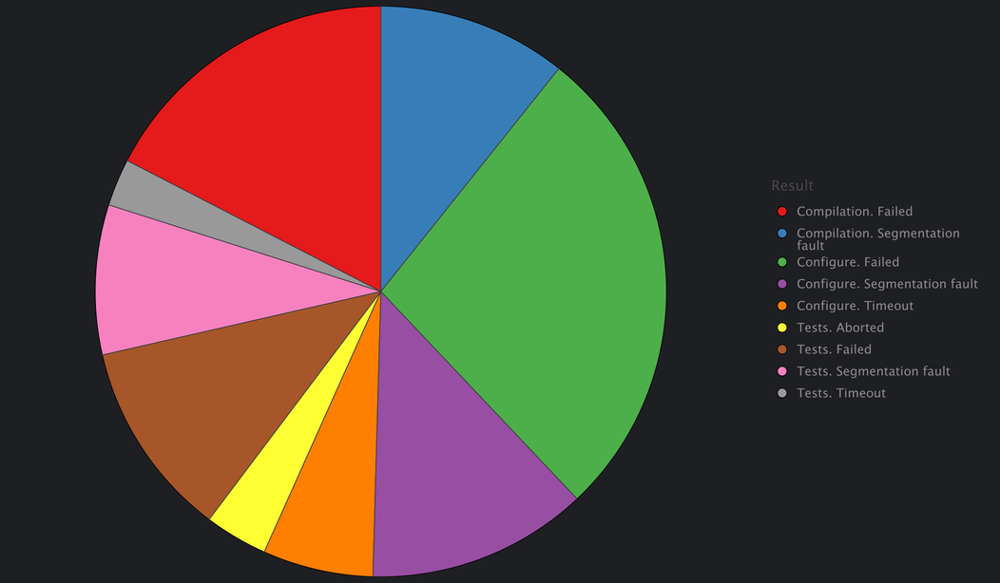

:cpython: https://github.com/python/cpython
:argo-workflow: https://argoproj.github.io/workflows/
:jinja2: https://jinja.palletsprojects.com/en/

= About

This repository contains scripts to mass rebuild {cpython}[CPython].

Target build scripts content generated by combination of target platform, OS, compiler, etc.:

Platforms:

- amd64
- arm64

OS:

- Fedora 40
- Ubuntu 24.04

CPython:

- 3.12.4 (latest stable release)
- 3.13.0.b4 (latest beta release)

Compiler (version depends on OS):

- gcc
- clang

Compiler options:

- none (default options)
- Address Sanitizer
- Hardware Address Sanitizer
- Thread Sanitizer
- Static analyzer (gcc only)

Hardware Address Sanitizer additional options (clang only):

- none (default options)
- without tracking globals variables

Sanitizer link method:

- none (chose by compiler)
- shared
- static

Sanitizer runtime preload (via `LDPRELOAD`):

- enabled
- disabled

CPython configure options:

- debug
- default
- release
- no-gil

== Results
I made few starts:

- With Hardware Address Sanitizer on arm64
- With Static Analyzer on amd64
- Other configurations on amd64 on amd64

=== With Hardware Address Sanitizer on arm64

* No successful builds on GCC and enabled LD_PRELOAD
* No successful builds on clang and -mllvm -hwasan-globals=1
* No stable builds on GCC and static hwasan library (sometime works but failed tests can't be reproduced with clang)
* No successful builds on clang, static hwasan and enabled LD_PRELOAD (looks like preloaded library track the globals)

[format=csv]
|===
include::data/arm64-hwasan/arm64.csv[]
|===

=== With Static Analyzer on amd64

|=============================
| Python version | Error count

| 3.12.4
| 132
| 3.13.0b4
| 165
|=============================

[format=csv]
|===
include::data/amd64-sast/errors.csv[]
|===

=== Other configurations on amd64

image::data/amd64-other/chart-50.png[]

[format=csv]
|===
include::data/amd64-other/amd64.csv[]
|===

== Implementation details

=== Architecture

[mermaid]
----
include::arch.mermaid[]
----

=== Requirements
- {argo-workflow}[Argo Workflows]
- {jinja2}[Jinja2]

=== How to run
* Install dependencies:

[source, shell]
----
pip3 install -r requirements.txt
----

* Edit `render_templates.py` for your case:
[source, shell]
----
vim render_templates.py
----

* Generate scripts (output in `.csv` format)
[source, shell]
----
python3 render_templates.py > table.csv
----

* Build images (and push, if necessary)
[source, shell]
----
docker build --platform=linux/amd64 -f ubuntu.dockerfile -t nbesdev/build-cpython:ubuntu .
docker build --platform=linux/amd64 -f fedora.dockerfile -t nbesdev/build-cpython:fedora .

docker push nbesdev/build-cpython:ubuntu
docker push nbesdev/build-cpython:fedora
----

* Fill the queue:
[source, shell]
----
argo submit workflow.yaml
----

* Get data:
[source, shell]
----
kubectl port-forward -n argo service/minio 9001 9000
mc cp --recursive minio/my-bucket
----

* Analyze logs

* .·°՞(¯□¯)՞°·.
